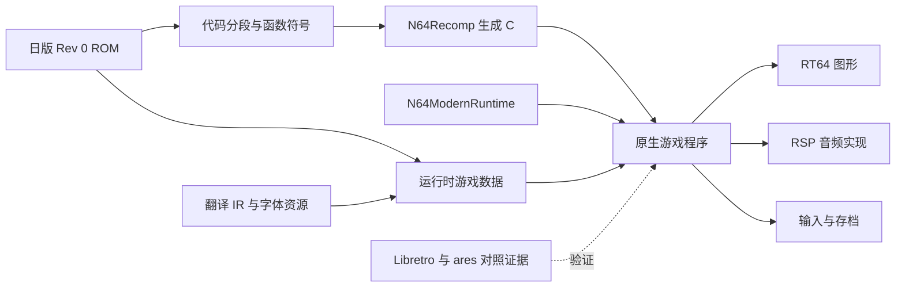

> **Language / Ngôn ngữ:** [English](recomp-plan.en.md) · [Tiếng Việt](recomp-plan.vi.md) · [中文](recomp-plan.md)

# SRW64 static recompilation solution

It is recommended to use **N64Recomp + N64ModernRuntime + RT64**, first complete the Japanese version of the native playable vertical sample,
Then access the native language directory and art assets. The first round of investment is used to confirm code layout, system calls and RSP microcode;
The first product threshold is "new game → first complete battle → pass and prepare → save → load files after exiting".

This solution is planned based on macOS arm64 as the first development and acceptance platform, and will be expanded to Windows/Linux later.
This is an implementation order recommendation. Date: 2026-09-08; Warehouse inspection base point:
`bc93a869e99fcafaf2c836751a6d46ee9c7a14dc`.
Currently in implementation, function-level native decompression and audio task comparison are completed; complete game generation, linking and
The native scene is still not passed. The actual measured progress is based on [recomp-progress.md](recomp-progress.md).
The table below retains the starting point at the time of planning; items that have changed are explicitly updated by the schedule document.

**Existing foundation and this actual investigation**

| Project | Current Evidence | Effect on recomp |
| --- | --- | --- |
| Japanese version baseline | This recalculation SHA-256 matches `config/srw64-jp-rev0.json`; 32 MiB, NS4J, Rev 0 | All mappings and symbols are bound to the same input |
| ROM entry field | ROM header `0x08` read `0x80076610` | Clues to start analysis; the actual load range and initialization conditions still need to be traced |
| Graphic microcode clues | ROM `0x00059BD8` has `RSP Gfx ucode F3DEX       fifo 2.08` flag | Prioritize verification of the corresponding processing path of RT64; string does not equal compatibility acceptance |
| Text and resources | 20 tables, 51,174 records; LZ resource encoding and decoding and lossless IR are available | Support diagnosis, Chinese resource import and regression control |
| Emulator comparison | There are Libretro routes, screenshots and ares debugging probes; this review report and core hash | used as the behavior oracle of the native version; there is no re-running the game this time |
| Archive clues | Local `rom.ram` is 32 KiB; `SRW64V3` is documented, ROM can also find the flag | SRAM is a hypothesis to be confirmed; file size alone does not justify archive API, layout, or import format |
| Current gap | Repository does not yet have recomp configuration, CPU symbols, snippet/overlay manifest | Critical path starts with reverse metadata |

Japanese version ROM SHA-256:
`ee5f4a21d8e5f7827d21199e27800edf250df9a8e4d10befb1a6992df597b13e`.
The original ROM, glyph map, and toolchain identities are found in [Source Record](../guide/provenance.md).

**Technical Routes and Boundaries**

N64Recomp translates recognized MIPS functions into C; game logic still follows the original memory and execution semantics.
N64ModernRuntime provides libultra system capabilities and recompiled code bridging; graphics are handed over to RT64,
Audio microcode is separately identified and accessed. Nativeization here still includes a compatible implementation of N64 hardware behavior.
[N64Recomp](https://github.com/N64Recomp/N64Recomp)、
[N64ModernRuntime](https://github.com/N64Recomp/N64ModernRuntime).



The reason for choosing this route is to be able to gradually restore the necessary functions, segments and system boundaries. complete matching
decomp can be accumulated as a long-term study; the first sample only requires the closure of the target path and its dependencies.
Self-written game engines will increase the cost of re-implementation of combat, AI, event scripts and archive semantics, and will not be included in the first phase.

Metadata can go directly to `ROM + symbols TOML`. N64Recomp for this review
`src/config.cpp` has parsed `symbols_file_path`, `rom/vram/size` of section,
and `name/vram/size` for functions. The "ELF only" description in its README lags behind the code,
The implementation is subject to the actual parser of the fixed commit.
[Configuration parsing source code](https://github.com/N64Recomp/N64Recomp/blob/ffb39cdad1da5de07eaaa48bd1db4a89a7986771/src/config.cpp).

The segmentation tool candidate is [splat](https://github.com/ethteck/splat) and the MIPS analysis candidate is
[spimdisasm](https://github.com/Decompollaborate/spimdisasm). First generate function candidates,
Then through control flow, references and runtime trace revision. Maintainable disassembly/ELF link for verification and patching
Symbol export, but full C source recovery does not have to be done first. The automatic identification results are not directly considered as final function boundaries.

**R0: Feasibility survey, recommended budget is 3–5 working days**

The goal is to produce reviewable judgments and the minimal mapping required for the next stage.

1. Start copying, BSS clearing, stack and initial thread from the entry trace, and establish ROM file offset and RDRAM
Segment correspondence of addresses. Record the relationship between the entry field and the actual first game function. It is forbidden to give full ROM
Apply the same fixed offset.
2. From startup to title, protagonist selection, map entry and battle, each records PI DMA, decompression target, and code loading.
and execution address. Distinguish between resident code, overriding loaded code and ordinary resources. It cannot currently be assumed that it does not exist
overlay, compressed code, TLB mapping, or self-modifying code.
3. Identify startup/thread/message queue/timing/controller/PI/SI/SP/VI/AI/archive related functions and establish
Table of "ROM function → runtime implementation or to-be-implemented adaptation". Library function signature must be composed of disassembly, parameters
Cross-check with the call point.
4. Sample the type, microcode code/data address and size, content hash, and
Command buffering and triggering scenes. Investigate the title, map, full battle animation, and audio missions separately to confirm
Whether `F3DEX fifo 2.08` is the actual running version and whether other microcode exists.
5. Build a fixed version of the runtime/renderer minimum host on macOS arm64, verify the window,
Graphics initialization and audio output callbacks. This item only proves host integration; it needs to be judged by the SRW64 task sample.
Rendering and audio compatibility.

R0 product recommendations are `segments.json`, `functions.csv`, `os-bindings.csv`,
`rsp-tasks.json`, `risks.md`. JSON uses versioned `schema`; each judgment comes with
`candidate/static-verified/runtime-observed` Status and evidence path.

Passing the threshold: clearly explain the startup path and code sources of covered scenarios, and list the system adaptation gaps.
And the respective implementation paths of graphics and audio microcode are given. If you find that you rely on large-scale self-modifying code or complex microcode
Overlay or hardware behavior for which there is no feasible processing path, first perform special verification on this item and re-estimate the construction period.
Days 3–5 are decision budgets and there is no guarantee that all unknowns will be eliminated in this round.

**R1: CPU recompilation and system access, recommended budget is 1–3 weeks**

Taking R0 mapping as input, it maintains sections, function entries and sizes, jump tables and data references. for each
The code segment retains the source byte hash; if there is compressed code, record the original ROM range, decoding algorithm, and decoded
Image offset and running address. The expanded image used for recompilation must be explicitly associated with the runtime original ROM address.

The generator rejects out-of-bounds, unexpected overlaps, zero-length functions, and unexplained direct jumps in advance; register what is allowed separately
Aliases, tail calls, and jump tables. Static call closures and dynamic call traces work together to complete indirect calls.
Overlay updates the function lookup table by loading/unloading. If the same address corresponds to different codes, it cannot be cached only by address.

Access to libultra alternative implementation, handling memory endianness, 32-bit addresses, MIPS 64-bit register semantics,
FPU mode and startup status. Direct MMIO, polling, CP0, exceptions and cache/TLB paths are reviewed individually.
Unresolved calls or necessary system behaviors that are not connected must explicitly report errors, and the unified empty implementation cannot be used to advance the process.

Passing threshold: Generating C and host compilation pass; SRW64 native threads can advance from cold start to the first batch of stable
VI/graphics/audio task submission, input and message queues have verifiable activity. There may not be a complete picture at this stage.
But the report must differentiate between "Build Successfully", "Compile Successfully" and "Native CPU Path Run Successfully".

**R2: Japanese version graphics, audio and input, recommended budget 1–3 weeks**

Connect actual graphics tasks to RT64, giving priority to maintaining the original frame, rendering rhythm and texture filtering behavior.
RT64 currently offers Metal, Vulkan and D3D12 backends, macOS prefers Metal; SRW64’s
Correctness requires individual acceptance. [RT64 capabilities and architecture](https://github.com/rt64/rt64/blob/43373749dac9bbc1b653e6a02aed40a9e1783bed/README.md).

Focus on checking the I4 font library, transparency, texture rectangle, cropping, menu highlighting, battle background, special effects and frame buffer
Read back. If HLE cannot handle the actual microcode, evaluate a dedicated prototype of RSP recompilation with the low-level RDP path;
This requires additional integration and cannot be considered an existing one-click fallback. Prioritize explaining differences at the game adaptation layer.

Audio first identifies the microcode and then selects an existing compatible implementation or RSPRecomp. Compare output for captured tasks
Buffering, task completion semantics and sampling rate, and then accept menu sound effects, BGM, combat sound effects and actual occurrences
Speech samples. The microcode overlay capability of RSPRecomp needs to be verified against a fixed version, and graphics support cannot be
Derivatives for audio are also supported.
[RSPRecomp source code](https://github.com/N64Recomp/N64Recomp/tree/ffb39cdad1da5de07eaaa48bd1db4a89a7986771/RSPRecomp).

Pass the threshold: cold start, title, protagonist selection, name confirmation, target plot and first tactical map are operable,
The pictures and sounds have been compared and accepted, and there are no unexplained calls or tasks in the process. Original VI frequency, logic updates
Frequency and effective screen update frequency are measured separately; the 60 Hz reported by Libretro does not equal the game's native 60 FPS.

**R3: Japanese version playable closed loop, recommended budget is 1–2 weeks**

The first main route follows the existing female super line to shorten the preparation time for comparison scenes and extends it to
Movement, attacks, full combat animations, enemy turns, clearance and preparation. Whether the original version supports animation skipping is not yet available
Confirmed through first-hand information or runtime entrance, not as a required test item for the current original closed-loop; natively added skip function
Reserved for subsequent enhancements. Other protagonists do it first
Coverage at the beginning, and then expand the respective branches later.

After confirming the archive hardware call, verification and container format, add independent archive directories and atomic writes. take copy
Test blank archive, save, close process, restart file loading and overwrite save. The emulator live state can only be used with
Reference side forensics cannot be directly used as an archive or cold start replacement for the native program.

Pass the threshold: Complete at least one route "New Game → A Complete Battle → Pass and Prepare → Save →
Exit the process → Restart and continue reading files", and the key status is consistent with the reference end. native save appears
Don't call a runnable version of the title a playable version until it's successful.

**R4: Native language and content**

Update 2026-09-12: Language unification is provided by the Unicode directory of `content/locales/`.
Original Japanese ROM, full TextKey, original text summary and script barriers remain fixed, native fonts take care of line breaks,
Pagination and reading presentation. The old patch ROM and glyph distribution process has been removed.

Now the data text is provided by the word list, and the plot and battle lines are provided in Chinese and English translations by the line text file. For details, see [Content Structure](../native/native-content-foundation.md).
Full translation, other menu consumers, name localization and each route save and read files still need to be verified one by one;
Directory resolvability cannot be used in place of target screen acceptance.

**R5: Covering expansion and issuance preparation, rolling estimation based on new risks**

Covers four protagonists, representative route branches, later maps and events, different battles/weapons/special effects, maintenance menus,
Game over and ending. Establish a coverage table of "Content Scenario × System Capability"; the function hit rate is used to locate gaps.
It cannot be substituted for route acceptance. After the cross-platform build is passed, each platform still needs to be run and checked.

Link Battler / Transfer Pak Single column compatibility task, first clarify the original behavior when there is no device,
The device protocol and data exchange will be implemented later; directly modifying the linkage unlock flag should be another optional function.
It cannot be counted as linkage compatibility. The first sample does not require this function as a prerequisite.

Suggested order for experience improvement: Stable archiving and key settings → Screen reading and text experience → High resolution → Widescreen →
High refresh rate. Wide screen needs to deal with 2D UI, battle background and cropping; high refresh rate needs to distinguish between frame insertion and logical update
(See [60fps.md](60fps.md) for research, which will be done in the future).
All are added on a per-scenario basis after the original behavioral baseline is passed.

**Regression Evidence Design**

| Hierarchy | What does passing mean | What is not enough to prove |
| --- | --- | --- |
| Static | Identities, mappings, symbols, resources and generated results satisfy checks | Game can run |
| Compilation | Generated code and host able to link | Boot, screen or system behavior is correct |
| Native launch | New process entering target initialization/mission boundary | Tactics and combat paths playable |
| Native scenes | Complete specific scenes under specified ROM/program/input | Full route coverage |
| Native closed loop | Save and load files are established after combat, clearance and process restart | Full content and linkage compatible |

The reference side reuses the input data and scene intent of `tools/recomp/probes/libretro_runner.py`; the native side needs new
Input playback, status observation, screenshot and log adapter, Libretro frame number cannot be directly regarded as native rendering frame number.
Sync by VI/controller sampling or scene conditions first, then refine deterministic playback. Compare menus after unifying input semantics
Location, text key, turn, unit HP/EN, funds and save fields; random seed/state can be fixed when
When comparing precise combat results, random differences cannot be directly judged as regression.

Visual comparison aligns size, frame, and content, registering explainable rendering differences such as filtering and dithering, while manually
Review key frames; PNG hashes are not required to be the same across renderers. Check the audio task output separately,
Sustained playback and actual listening. The existing software reference configuration is Angrylion RDP + CXD4 RSP.

Each native report should document the base ROM/actual data image, binaries, symbols, dependencies, configuration, input and
Hash of archived seeds, as well as platforms, scenes, logical observations, screenshots/audio evidence and passing boundaries. code,
System binding and beautification patches are registered separately to avoid unattributable mixed modifications.

**Recommended Directory and Commit Boundaries**

In the early stage, it will continue to be placed in the current warehouse so that ROM identity access control and Chinese IR can be used together. The following is to be created
Catalog design; only planning documents will be added this time.

```text
config/recomp/                 分段、生成配置、系统绑定、依赖版本
symbols/                       审阅后的 section/function/data 元数据
tools/recomp/                  提取、符号导出、校验与回放工具
native/                        CMake、宿主入口、输入/存档/任务适配
native/patches/                有证据与回归用例的游戏适配和后续改进
tests/recomp/                  合成输入测试与元数据约束
docs/recomp/                   决策、风险、场景矩阵和验收记录
build/recomp/                  忽略：ROM 派生代码、映像、任务、二进制和截图
```

Continue to adhere to [Contribution Specifications](../../CONTRIBUTING.md): original/modified ROMs, extracted assets, RAM,
Archives, fonts, and generated code are retained in the local output directory; source code submission consists of configurations, tools, symbols, handwriting
Adaptation, testing and documentation components. Public CI checks configuration and hosting using synthetic input; generation of real ROM vs.
Run acceptance is performed locally. In the first round, press "Survey Tools and Records → Symbol Generation → System Adaptation → Graphics/
Audio → Playable Return → Chinese Access” submitted separately.

Dependencies are locked on version combinations that can be built together, and recursive submodule version and license lists are kept.
N64ModernRuntime is currently marked with GPL-3.0, and host integration and source code distribution arrangements need to be handled according to the selected dependencies;
N64Recomp and RT64 are currently marked MIT. The host code of published projects is only used as a sourced reference.

**Upstream inspection snapshot and construction period usage**

The following is a snapshot of the upstream branch queried on 2026-09-08 for review of the source code, which has not yet been verified as co-buildable
SRW64 toolchain combination:

| Upstream | Check commits |
| --- | --- |
| [N64Recomp](https://github.com/N64Recomp/N64Recomp/commit/ffb39cdad1da5de07eaaa48bd1db4a89a7986771) | `ffb39cdad1da5de07eaaa48bd1db4a89a7986771` |
| [N64ModernRuntime](https://github.com/N64Recomp/N64ModernRuntime/commit/cdf5abbd5026fef5c364c676e4667c45e42b6863) | `cdf5abbd5026fef5c364c676e4667c45e42b6863` |
| [RT64](https://github.com/rt64/rt64/commit/43373749dac9bbc1b653e6a02aed40a9e1783bed) | `43373749dac9bbc1b653e6a02aed40a9e1783bed` |
| [Zelda64Recomp Host Reference](https://github.com/Zelda64Recomp/Zelda64Recomp/commit/1a9c26613c6e0906140dc8bcca7362cbe00bf1eb) | `1a9c26613c6e0906140dc8bcca7362cbe00bf1eb` |

The N64Recomp embedded in this N64ModernRuntime snapshot is
`81213c1831fab2521a6a5459c67b63437d67e253`, which is different from the latest independent upstream commit in the above table.
The runtime package version should be verified first; if higher version functionality is required, then explicitly build/link/run
Return to upgrade. Zelda's symbols and game patches are not directly available for SRW64.

Under the condition that one person is full-time and the main system boundaries can be directly adapted, the initial workload of R0–R4 is about **5–10 weeks**,
Full content and cross-platform verification are included. This is a conditional planning estimate with low confidence and should be reestimated after R0.
Complex overlays, self-modifying code, microcode adaptation, or timing issues can significantly increase investment.

The next step is to implement R0 and give priority to delivery **Start/load mapping, CPU function candidates, system binding gaps,
Actual RSP task list, and judgment to continue investing**. Whether or not to move forward will be determined by these results.