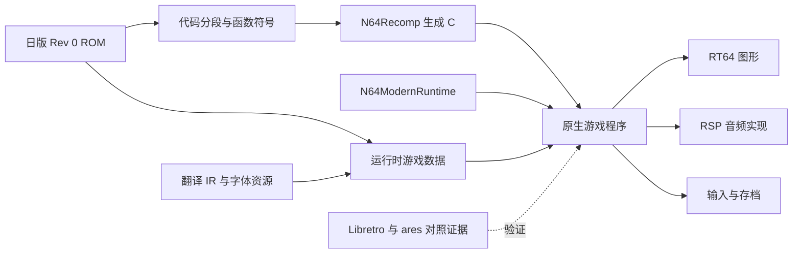

> **Ngôn ngữ / Language:** [Tiếng Việt](recomp-plan.vi.md) · [English](recomp-plan.en.md) · [中文](recomp-plan.md)

# Giải pháp biên dịch lại tĩnh SRW64

Bạn nên sử dụng **N64Recomp + N64ModernRuntime + RT64**, trước tiên hãy hoàn thành phiên bản tiếng Nhật của mẫu dọc có thể chơi được gốc,
Sau đó truy cập vào thư mục ngôn ngữ bản địa và nội dung nghệ thuật. Vòng đầu tư đầu tiên được sử dụng để xác nhận bố cục mã, lệnh gọi hệ thống và vi mã RSP;
Ngưỡng sản phẩm đầu tiên là "trò chơi mới → trận chiến hoàn thành đầu tiên → vượt qua và chuẩn bị → lưu → tải tệp sau khi thoát".

Giải pháp này được lên kế hoạch dựa trên macOS arm64 làm nền tảng phát triển và chấp nhận đầu tiên và sẽ được mở rộng sang Windows/Linux sau này.
Đây là một khuyến nghị về trình tự thực hiện. Ngày: 2026-09-08; Điểm cơ sở kiểm tra kho:
`bc93a869e99fcafaf2c836751a6d46ee9c7a14dc`.
Hiện đang trong quá trình triển khai, quá trình giải nén gốc và so sánh tác vụ âm thanh ở cấp độ chức năng đã hoàn tất; hoàn thành việc tạo trò chơi, liên kết và
Cảnh quê hương vẫn chưa qua. Tiến trình đo được thực tế dựa trên [recomp-progress.md](recomp-progress.md).
Bảng dưới đây giữ nguyên điểm xuất phát tại thời điểm quy hoạch; các mục đã thay đổi sẽ được cập nhật rõ ràng bằng tài liệu lịch trình.

**Nền tảng hiện có và cuộc điều tra thực tế này**

| Dự án | Bằng chứng hiện tại | Hiệu ứng trên recomp |
| --- | --- | --- |
| Bản gốc phiên bản tiếng Nhật | Phép tính lại SHA-256 này khớp với `config/srw64-jp-rev0.json`; 32 MiB, NS4J, Rev 0 | Tất cả ánh xạ và ký hiệu đều được liên kết với cùng một đầu vào |
| Trường nhập ROM | Tiêu đề ROM `0x08` đã đọc `0x80076610` | Manh mối để bắt đầu phân tích; phạm vi tải thực tế và điều kiện khởi tạo vẫn cần được theo dõi |
| Manh mối vi mã đồ họa | ROM `0x00059BD8` có cờ `RSP Gfx ucode F3DEX       fifo 2.08` | Ưu tiên xác minh đường dẫn xử lý tương ứng của RT64; chuỗi không được chấp nhận tương thích bằng nhau |
| Văn bản và tài nguyên | 20 bảng, 51.174 bản ghi; Mã hóa và giải mã tài nguyên LZ và IR không mất dữ liệu có sẵn | Hỗ trợ chẩn đoán, nhập tài nguyên Trung Quốc và kiểm soát hồi quy |
| So sánh trình giả lập | Có các tuyến đường Libretro, ảnh chụp màn hình và các đầu dò gỡ lỗi; báo cáo đánh giá này và hàm băm cốt lõi | được sử dụng làm lời tiên tri về hành vi của phiên bản gốc; lần này không chạy lại trò chơi |
| Lưu trữ manh mối | `rom.ram` địa phương là 32 KiB; `SRW64V3` đã được ghi lại, ROM cũng có thể tìm thấy cờ | SRAM là một giả thuyết cần được xác nhận; kích thước tệp riêng không chứng minh được API lưu trữ, bố cục hoặc định dạng nhập |
| Khoảng cách hiện tại | Kho lưu trữ chưa có cấu hình recomp, ký hiệu CPU, bảng kê khai đoạn trích/lớp phủ | Đường dẫn quan trọng bắt đầu bằng siêu dữ liệu ngược |

ROM SHA-256 phiên bản tiếng Nhật:
`ee5f4a21d8e5f7827d21199e27800edf250df9a8e4d10befb1a6992df597b13e`.
ROM gốc, bản đồ glyph và danh tính chuỗi công cụ được tìm thấy trong [Bản ghi nguồn](../guide/provenance.md).

**Tuyến đường và ranh giới kỹ thuật**

N64Recomp dịch các hàm MIPS được nhận dạng sang C; logic trò chơi vẫn tuân theo ngữ nghĩa thực thi và bộ nhớ ban đầu.
N64ModernRuntime cung cấp các khả năng của hệ thống libultra và bắc cầu mã được biên dịch lại; đồ họa được bàn giao cho RT64,
Mã vi âm thanh được xác định và truy cập riêng biệt. Bản địa hóa ở đây vẫn bao gồm việc triển khai tương thích hành vi phần cứng N64.
[N64Recomp](https://github.com/N64Recomp/N64Recomp)、
[N64ModernRuntime](https://github.com/N64Recomp/N64ModernRuntime).



Lý do lựa chọn tuyến đường này là để có thể khôi phục dần các chức năng, phân đoạn và ranh giới hệ thống cần thiết. kết hợp hoàn chỉnh
decomp có thể được tích lũy như một nghiên cứu dài hạn; mẫu đầu tiên chỉ yêu cầu đóng đường dẫn đích và các phần phụ thuộc của nó.
Các công cụ trò chơi tự viết sẽ làm tăng chi phí triển khai lại chiến đấu, AI, kịch bản sự kiện và ngữ nghĩa lưu trữ và sẽ không được đưa vào giai đoạn đầu.

Siêu dữ liệu có thể truy cập trực tiếp vào `ROM + symbols TOML`. N64Recomp cho bài đánh giá này
`src/config.cpp` đã phân tích cú pháp `symbols_file_path`, `rom/vram/size` của phần,
và `name/vram/size` cho các hàm. Mô tả "Chỉ ELF" trong README của nó chậm hơn mã,
Việc triển khai tùy thuộc vào trình phân tích cú pháp thực tế của cam kết cố định.
[Mã nguồn phân tích cú pháp cấu hình](https://github.com/N64Recomp/N64Recomp/blob/ffb39cdad1da5de07eaaa48bd1db4a89a7986771/src/config.cpp).

Ứng viên công cụ phân đoạn là [splat](https://github.com/ethteck/splat) và ứng cử viên phân tích MIPS là
[sự vô cảm](https://github.com/Decompollaborate/spimdisasm). Đầu tiên tạo các ứng cử viên chức năng,
Sau đó thông qua luồng điều khiển, tham chiếu và sửa đổi dấu vết thời gian chạy. Liên kết tháo gỡ/ELF có thể bảo trì để xác minh và vá lỗi
Xuất biểu tượng, nhưng việc khôi phục nguồn C đầy đủ không cần phải được thực hiện trước. Kết quả nhận dạng tự động không được coi trực tiếp là ranh giới chức năng cuối cùng.

**R0: Khảo sát khả thi, ngân sách đề xuất là 3–5 ngày làm việc**

Mục tiêu là đưa ra các đánh giá có thể xem xét lại và lập bản đồ tối thiểu cần thiết cho giai đoạn tiếp theo.

1. Bắt đầu sao chép, xóa BSS, xếp chồng và luồng ban đầu từ dấu vết mục nhập, đồng thời thiết lập offset tệp ROM và RDRAM
Phân đoạn tương ứng của địa chỉ. Ghi lại mối quan hệ giữa trường nhập và chức năng trò chơi đầu tiên thực tế. Cấm tặng rom đầy đủ
Áp dụng cùng một mức bù cố định.
2. Từ khởi động đến tiêu đề, lựa chọn nhân vật chính, vào bản đồ và chiến đấu, mỗi bản ghi PI DMA, mục tiêu giải nén và tải mã.
và địa chỉ thực hiện. Phân biệt giữa mã thường trú, mã ghi đè được tải và tài nguyên thông thường. Hiện tại không thể cho rằng nó không tồn tại
lớp phủ, mã nén, ánh xạ TLB hoặc mã tự sửa đổi.
3. Xác định các chức năng liên quan đến khởi động/luồng/tin nhắn/thời gian/bộ điều khiển/PI/SI/SP/VI/AI/lưu trữ và thiết lập
Bảng "Chức năng ROM → triển khai thời gian chạy hoặc điều chỉnh sắp được triển khai". Chữ ký hàm thư viện phải bao gồm các tham số tháo rời
Kiểm tra chéo với điểm gọi.
4. Lấy mẫu loại, mã vi mã/địa chỉ dữ liệu và kích thước, hàm băm nội dung và
Cảnh đệm và kích hoạt lệnh. Điều tra tiêu đề, bản đồ, hoạt ảnh chiến đấu đầy đủ và nhiệm vụ âm thanh một cách riêng biệt để xác nhận
Liệu `F3DEX fifo 2.08` có phải là phiên bản đang chạy thực tế hay không và liệu vi mã khác có tồn tại hay không.
5. Xây dựng phiên bản cố định của máy chủ tối thiểu thời gian chạy/trình kết xuất trên macOS arm64, xác minh cửa sổ,
Khởi tạo đồ họa và gọi lại đầu ra âm thanh. Mục này chỉ chứng minh sự tích hợp máy chủ; nó cần được đánh giá bằng mẫu nhiệm vụ SRW64.
Khả năng tương thích kết xuất và âm thanh.

Đề xuất sản phẩm R0 là `segments.json`, `functions.csv`, `os-bindings.csv`,
`rsp-tasks.json`, `risks.md`. JSON sử dụng `schema` đã được phiên bản; mỗi bản án đi kèm với
`candidate/static-verified/runtime-observed` Đường dẫn trạng thái và bằng chứng.

Vượt ngưỡng: giải thích rõ ràng đường dẫn khởi động và nguồn mã của các kịch bản được đề cập, đồng thời liệt kê các lỗ hổng thích ứng của hệ thống.
Và các đường dẫn triển khai tương ứng của vi mã đồ họa và âm thanh được đưa ra. Nếu bạn thấy rằng bạn dựa vào mã tự sửa đổi quy mô lớn hoặc vi mã phức tạp
Hoạt động của lớp phủ hoặc phần cứng không có đường dẫn xử lý khả thi, trước tiên hãy thực hiện xác minh đặc biệt đối với hạng mục này và ước tính lại thời gian xây dựng.
Ngày 3–5 là thời gian quyết định và không có gì đảm bảo rằng tất cả những điều chưa biết sẽ bị loại bỏ trong vòng này.

**R1: Biên dịch lại CPU và truy cập hệ thống, ngân sách đề xuất là 1–3 tuần**

Lấy ánh xạ R0 làm đầu vào, nó duy trì các phần, mục nhập chức năng và kích thước, bảng nhảy và tham chiếu dữ liệu. cho mỗi
Đoạn mã giữ lại hàm băm byte nguồn; nếu có mã nén thì ghi lại dãy ROM gốc, thuật toán giải mã và giải mã
Offset hình ảnh và địa chỉ đang chạy. Hình ảnh mở rộng được sử dụng để biên dịch lại phải được liên kết rõ ràng với địa chỉ ROM gốc thời gian chạy.

Trình tạo từ chối trước các giá trị vượt quá giới hạn, sự chồng chéo không mong muốn, các hàm có độ dài bằng 0 và các bước nhảy trực tiếp không giải thích được; đăng ký những gì được phép riêng
Bí danh, gọi đuôi và nhảy bảng. Kết thúc cuộc gọi tĩnh và theo dõi cuộc gọi động phối hợp với nhau để hoàn thành cuộc gọi gián tiếp.
Lớp phủ cập nhật bảng tra cứu hàm bằng cách tải/dỡ tải. Nếu cùng một địa chỉ tương ứng với các mã khác nhau thì địa chỉ đó không thể chỉ được lưu vào bộ đệm theo địa chỉ.

Truy cập vào triển khai thay thế libultra, xử lý độ bền của bộ nhớ, địa chỉ 32 bit, ngữ nghĩa đăng ký MIPS 64 bit,
Chế độ FPU và trạng thái khởi động. Các đường dẫn MMIO trực tiếp, bỏ phiếu, CP0, ngoại lệ và bộ đệm/TLB được xem xét riêng lẻ.
Các cuộc gọi chưa được giải quyết hoặc các hành vi cần thiết của hệ thống không được kết nối phải báo cáo lỗi rõ ràng và không thể sử dụng triển khai trống thống nhất để thúc đẩy quy trình.

Ngưỡng vượt qua: Tạo C và vượt qua quá trình biên dịch máy chủ; Các luồng gốc SRW64 có thể chuyển từ giai đoạn khởi động nguội sang giai đoạn ổn định đầu tiên
Hàng đợi gửi tác vụ VI/đồ họa/âm thanh, hàng đợi đầu vào và tin nhắn có hoạt động có thể kiểm chứng được. Có thể không có một bức tranh hoàn chỉnh ở giai đoạn này.
Tuy nhiên, báo cáo phải phân biệt giữa "Xây dựng thành công", "Biên dịch thành công" và "Chạy đường dẫn CPU gốc thành công".

**R2: Đồ họa, âm thanh và đầu vào phiên bản tiếng Nhật, ngân sách đề xuất 1–3 tuần**

Kết nối các tác vụ đồ họa thực tế với RT64, ưu tiên duy trì khung hình gốc, nhịp điệu hiển thị và hành vi lọc kết cấu.
RT64 hiện cung cấp các phụ trợ Metal, Vulkan và D3D12, macOS thích Metal hơn; SRW64
Sự đúng đắn đòi hỏi sự chấp nhận của cá nhân. [Khả năng và kiến ​​trúc RT64](https://github.com/rt64/rt64/blob/43373749dac9bbc1b653e6a02aed40a9e1783bed/README.md).

Tập trung vào việc kiểm tra thư viện phông chữ I4, độ trong suốt, hình chữ nhật kết cấu, cắt xén, làm nổi bật menu, nền chiến đấu, hiệu ứng đặc biệt và bộ đệm khung
Đọc lại. Nếu HLE không thể xử lý vi mã thực tế, hãy đánh giá một nguyên mẫu chuyên dụng của quá trình biên dịch lại RSP bằng đường dẫn RDP cấp thấp;
Điều này yêu cầu tích hợp bổ sung và không thể được coi là phương án dự phòng chỉ bằng một cú nhấp chuột hiện có. Ưu tiên giải thích sự khác biệt ở lớp thích ứng trò chơi.

Trước tiên, âm thanh sẽ xác định vi mã, sau đó chọn triển khai tương thích hiện có hoặc RSPRecomp. So sánh đầu ra cho các tác vụ đã chụp
Bộ đệm, ngữ nghĩa hoàn thành nhiệm vụ và tốc độ lấy mẫu, sau đó chấp nhận hiệu ứng âm thanh menu, BGM, hiệu ứng âm thanh chiến đấu và các lần xuất hiện thực tế
Các mẫu lời nói. Khả năng lớp phủ vi mã của RSPRecomp cần được xác minh dựa trên phiên bản cố định và không thể hỗ trợ đồ họa
Các dẫn xuất cho âm thanh cũng được hỗ trợ.
[Mã nguồn RSPRecomp](https://github.com/N64Recomp/N64Recomp/tree/ffb39cdad1da5de07eaaa48bd1db4a89a7986771/RSPRecomp).

Vượt qua ngưỡng: khởi đầu nguội, danh hiệu, lựa chọn nhân vật chính, xác nhận tên, cốt truyện mục tiêu và bản đồ chiến thuật đầu tiên đều có thể hoạt động được,
Hình ảnh và âm thanh đã được so sánh và chấp nhận, đồng thời không có cuộc gọi hoặc tác vụ nào không giải thích được trong quá trình này. Tần số VI gốc, cập nhật logic
Tần suất và tần suất cập nhật màn hình hiệu quả được đo riêng; 60 Hz do Libretro báo cáo không bằng 60 FPS gốc của trò chơi.

**R3: Phiên bản tiếng Nhật có thể chơi được, ngân sách đề xuất là 1–2 tuần**

Lộ trình chính đầu tiên đi theo tuyến nữ siêu nhân hiện có nhằm rút ngắn thời gian chuẩn bị cho các cảnh so sánh và kéo dài đến
Di chuyển, tấn công, hoạt hình chiến đấu đầy đủ, xoay chuyển kẻ thù, dọn dẹp và chuẩn bị. Phiên bản gốc có hỗ trợ bỏ qua hoạt ảnh hay không vẫn chưa có
Được xác nhận thông qua thông tin trực tiếp hoặc lối vào thời gian chạy, không phải là hạng mục kiểm tra bắt buộc đối với vòng kín ban đầu hiện tại; chức năng bỏ qua vốn được thêm vào
Dành riêng cho những cải tiến tiếp theo. Các nhân vật chính khác làm điều đó trước
Phủ sóng ngay từ đầu, sau đó mở rộng các nhánh tương ứng.

Sau khi xác nhận cuộc gọi phần cứng lưu trữ, xác minh và định dạng vùng chứa, hãy thêm các thư mục lưu trữ độc lập và ghi nguyên tử. lấy bản sao
Kiểm tra kho lưu trữ trống, lưu, đóng quy trình, khởi động lại tải tệp và ghi đè lưu. Trạng thái trực tiếp của trình mô phỏng chỉ có thể được sử dụng với
Điều tra bên tham chiếu không thể được sử dụng trực tiếp làm kho lưu trữ hoặc thay thế khởi động nguội cho chương trình gốc.

Vượt qua ngưỡng: Hoàn thành ít nhất một lộ trình "Trò chơi mới → Trận chiến hoàn chỉnh → Vượt qua và chuẩn bị → Lưu →
Thoát khỏi quá trình → Khởi động lại và tiếp tục đọc tệp" và trạng thái khóa nhất quán với đầu tham chiếu. lưu gốc xuất hiện
Đừng gọi phiên bản có thể chạy được của tựa game là phiên bản có thể chơi được cho đến khi nó thành công.

**R4: Ngôn ngữ và nội dung bản địa**

Cập nhật 12-09-2026: Hợp nhất ngôn ngữ được cung cấp bởi thư mục Unicode của `content/locales/`.
ROM gốc tiếng Nhật, TextKey đầy đủ, tóm tắt văn bản gốc và các rào cản tập lệnh vẫn được cố định, phông chữ gốc đảm nhiệm việc ngắt dòng,
Phân trang và đọc trình bày. Quá trình phân phối glyph và ROM bản vá cũ đã bị xóa.

Bây giờ văn bản dữ liệu được cung cấp bởi danh sách từ, còn cốt truyện và đường chiến đấu được cung cấp trong bản dịch tiếng Trung và tiếng Anh bởi tệp văn bản dòng. Để biết chi tiết, hãy xem [Cấu trúc nội dung](../native/native-content-foundation.md).
Bản dịch đầy đủ, các trình đơn khác, bản địa hóa tên và từng tệp lưu và đọc tuyến đường vẫn cần được xác minh từng cái một;
Khả năng phân giải thư mục không thể được sử dụng thay cho việc chấp nhận màn hình mục tiêu.

**R5: Bao gồm việc mở rộng và chuẩn bị phát hành, ước tính luân phiên dựa trên các rủi ro mới**

Bao gồm bốn nhân vật chính, các nhánh tuyến đại diện, bản đồ và sự kiện sau này, các trận chiến/vũ khí/hiệu ứng đặc biệt khác nhau, menu bảo trì,
Trò chơi kết thúc và kết thúc. Thiết lập bảng bao quát "Kịch bản nội dung × Khả năng hệ thống"; tỷ lệ trúng chức năng được sử dụng để xác định vị trí các khoảng trống.
Nó không thể thay thế cho việc chấp nhận tuyến đường. Sau khi quá trình xây dựng đa nền tảng được thông qua, mỗi nền tảng vẫn cần được chạy và kiểm tra.

Liên kết Battler / Transfer Pak Nhiệm vụ tương thích cột đơn, trước tiên hãy làm rõ hành vi ban đầu khi không có thiết bị,
Giao thức thiết bị và trao đổi dữ liệu sẽ được thực hiện sau; trực tiếp sửa đổi cờ mở khóa liên kết phải là một chức năng tùy chọn khác.
Nó không thể được tính là khả năng tương thích liên kết. Mẫu đầu tiên không yêu cầu chức năng này là điều kiện tiên quyết.

Thứ tự đề xuất để cải thiện trải nghiệm: Lưu trữ ổn định và cài đặt khóa → Trải nghiệm đọc màn hình và văn bản → Độ phân giải cao → Màn hình rộng →
Tốc độ làm mới cao. Màn hình rộng cần xử lý giao diện người dùng 2D, nền chiến đấu và cắt xén; tốc độ làm mới cao cần phân biệt giữa chèn khung và cập nhật logic
(Xem [60fps.md](60fps.md) để biết nghiên cứu sẽ được thực hiện trong tương lai).
Tất cả đều được thêm vào theo từng kịch bản sau khi đường cơ sở hành vi ban đầu được thông qua.

**Thiết kế bằng chứng hồi quy**

| Hệ thống phân cấp | vượt qua có nghĩa là gì | Điều gì chưa đủ để chứng minh |
| --- | --- | --- |
| Tĩnh | Danh tính, ánh xạ, ký hiệu, tài nguyên và kết quả được tạo đáp ứng các kiểm tra | Game có thể chạy |
| Biên soạn | Mã được tạo và máy chủ có thể liên kết | Hành vi khởi động, màn hình hoặc hệ thống là chính xác |
| Ra mắt bản địa | Quy trình mới tiến vào ranh giới nhiệm vụ/khởi tạo mục tiêu | Chiến thuật và đường chiến đấu có thể chơi được |
| Cảnh bản địa | Hoàn thành các cảnh cụ thể theo ROM/chương trình/đầu vào được chỉ định | Bảo hiểm toàn tuyến |
| Vòng khép kín bản địa | Lưu và tải các tập tin được thiết lập sau khi chiến đấu, giải phóng mặt bằng và khởi động lại quy trình | Đầy đủ nội dung và liên kết tương thích |

Bên tham chiếu sử dụng lại dữ liệu đầu vào và ý định cảnh của `tools/recomp/probes/libretro_runner.py`; phía bản địa cần mới
Phát lại đầu vào, quan sát trạng thái, ảnh chụp màn hình và bộ điều hợp nhật ký, số khung Libretro không thể được coi trực tiếp là số khung hiển thị gốc.
Trước tiên, hãy đồng bộ hóa bằng cách lấy mẫu VI/bộ điều khiển hoặc điều kiện cảnh, sau đó tinh chỉnh quá trình phát lại xác định. So sánh các menu sau khi thống nhất ngữ nghĩa đầu vào
Vị trí, phím văn bản, lượt, đơn vị HP/EN, tiền và các trường lưu; hạt giống/trạng thái ngẫu nhiên có thể được cố định khi
Khi so sánh kết quả chiến đấu chính xác, sự khác biệt ngẫu nhiên không thể được đánh giá trực tiếp là sự hồi quy.

So sánh trực quan căn chỉnh kích thước, khung hình và nội dung, ghi lại các khác biệt hiển thị có thể giải thích được chẳng hạn như lọc và phối màu trong khi thực hiện thủ công
Xem lại các khung chính; Giá trị băm PNG không bắt buộc phải giống nhau trên các trình kết xuất. Kiểm tra riêng đầu ra tác vụ âm thanh,
Phát lại liên tục và nghe thực tế. Cấu hình tham chiếu phần mềm hiện có là Angrylion RDP + CXD4 RSP.

Mỗi báo cáo gốc phải ghi lại hình ảnh dữ liệu thực tế/ROM cơ sở, tệp nhị phân, ký hiệu, phần phụ thuộc, cấu hình, đầu vào và
Băm của các hạt giống được lưu trữ, cũng như nền tảng, cảnh, quan sát logic, ảnh chụp màn hình/bằng chứng âm thanh và vượt qua ranh giới. mã,
Các bản vá làm đẹp và ràng buộc hệ thống được đăng ký riêng để tránh các sửa đổi hỗn hợp không thể phân bổ được.

**Giới hạn thư mục và cam kết được đề xuất**

Trong giai đoạn đầu, nó sẽ tiếp tục được đặt trong kho hiện tại để kiểm soát truy cập nhận dạng ROM và IR Trung Quốc có thể được sử dụng cùng nhau. Sau đây sẽ được tạo ra
Thiết kế danh mục; chỉ có tài liệu quy hoạch sẽ được thêm vào lần này.

```text
config/recomp/                 分段、生成配置、系统绑定、依赖版本
symbols/                       审阅后的 section/function/data 元数据
tools/recomp/                  提取、符号导出、校验与回放工具
native/                        CMake、宿主入口、输入/存档/任务适配
native/patches/                有证据与回归用例的游戏适配和后续改进
tests/recomp/                  合成输入测试与元数据约束
docs/recomp/                   决策、风险、场景矩阵和验收记录
build/recomp/                  忽略：ROM 派生代码、映像、任务、二进制和截图
```

Tiếp tục tuân thủ [Thông số kỹ thuật đóng góp](../../CONTRIBUTING.md): ROM gốc/đã sửa đổi, nội dung được trích xuất, RAM,
Các kho lưu trữ, phông chữ và mã được tạo sẽ được giữ lại trong thư mục đầu ra cục bộ; việc gửi mã nguồn bao gồm các cấu hình, công cụ, ký hiệu, chữ viết tay
Các thành phần thích ứng, thử nghiệm và tài liệu. CI công khai kiểm tra cấu hình và lưu trữ bằng đầu vào tổng hợp; tạo ra ROM thực so với
Việc chấp nhận chạy được thực hiện cục bộ. Ở vòng đầu tiên, nhấn "Công cụ khảo sát và bản ghi → Tạo biểu tượng → Điều chỉnh hệ thống → Đồ họa/
Âm thanh → Trả về có thể phát được → Truy cập tiếng Trung” được gửi riêng.

Các phần phụ thuộc bị khóa trên các kết hợp phiên bản có thể được xây dựng cùng nhau và phiên bản mô-đun con đệ quy và danh sách giấy phép được giữ lại.
N64ModernRuntime hiện được đánh dấu bằng GPL-3.0 và việc sắp xếp phân phối mã nguồn và tích hợp máy chủ cần phải được xử lý theo các phụ thuộc đã chọn;
N64Recomp và RT64 hiện được đánh dấu MIT. Mã máy chủ của các dự án đã xuất bản chỉ được sử dụng làm tài liệu tham khảo có nguồn gốc.

**Ảnh chụp nhanh kiểm tra ngược dòng và thời gian sử dụng trong thời gian xây dựng**

Sau đây là ảnh chụp nhanh của nhánh thượng nguồn được truy vấn vào ngày 2026-09-08 để xem xét mã nguồn, mã này chưa được xác minh là có thể đồng xây dựng
Kết hợp chuỗi công cụ SRW64:

| Thượng nguồn | Kiểm tra cam kết |
| --- | --- |
| [N64Recomp](https://github.com/N64Recomp/N64Recomp/commit/ffb39cdad1da5de07eaaa48bd1db4a89a7986771) | `ffb39cdad1da5de07eaaa48bd1db4a89a7986771` |
| [N64ModernRuntime](https://github.com/N64Recomp/N64ModernRuntime/commit/cdf5abbd5026fef5c364c676e4667c45e42b6863) | `cdf5abbd5026fef5c364c676e4667c45e42b6863` |
| [RT64](https://github.com/rt64/rt64/commit/43373749dac9bbc1b653e6a02aed40a9e1783bed) | `43373749dac9bbc1b653e6a02aed40a9e1783bed` |
| [Tham khảo máy chủ Zelda64Recomp](https://github.com/Zelda64Recomp/Zelda64Recomp/commit/1a9c26613c6e0906140dc8bcca7362cbe00bf1eb) | `1a9c26613c6e0906140dc8bcca7362cbe00bf1eb` |

N64Recomp được nhúng trong ảnh chụp nhanh N64ModernRuntime này là
`81213c1831fab2521a6a5459c67b63437d67e253`, khác với cam kết ngược dòng độc lập mới nhất trong bảng trên.
Phiên bản gói thời gian chạy phải được xác minh trước tiên; nếu cần có chức năng phiên bản cao hơn thì hãy xây dựng/liên kết/chạy một cách rõ ràng
Quay trở lại để nâng cấp. Các biểu tượng và bản vá trò chơi của Zelda không có sẵn trực tiếp cho SRW64.

Trong điều kiện một người làm việc toàn thời gian và các ranh giới của hệ thống chính có thể được điều chỉnh trực tiếp, khối lượng công việc ban đầu của R0–R4 là khoảng **5–10 tuần**,
Nội dung đầy đủ và xác minh đa nền tảng được bao gồm. Đây là ước tính quy hoạch có điều kiện với độ tin cậy thấp và cần được đánh giá lại sau R0.
Các lớp phủ phức tạp, mã tự sửa đổi, thích ứng vi mã hoặc các vấn đề về thời gian có thể làm tăng đáng kể mức đầu tư.

Bước tiếp theo là triển khai R0 và ưu tiên phân phối **Ánh xạ khởi động/tải, ứng cử viên chức năng CPU, khoảng trống liên kết hệ thống,
Danh sách nhiệm vụ RSP thực tế và quyết định tiếp tục đầu tư**. Việc tiến lên phía trước hay không sẽ được quyết định bởi những kết quả này.