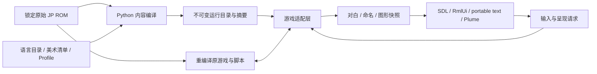

> **Language / Ngôn ngữ:** [English](native-development.en.md) · [Tiếng Việt](native-development.vi.md) · [中文](native-development.md)

# Native Development Guide

Updated: 2026-09-18. This article describes the current source code and development entrance; the current scope of the built-in function modules is shown in [Roadmap](../design/mod-roadmap.md), and external packages and public APIs are temporarily suspended. All paths are relative to the repository root directory.

## Current available range

The development entry is `scripts/Play SRW64 Native.command` → `tools/recomp/run/play_native.py --profile config/recomp/profiles/play-profile.json`. It runs a locked original JP Rev 0 ROM, with original scripts driving the game, and access to native display and input.

| Capabilities | Current implementation and limitations |
| --- | --- |
| Multi-language | F7 Press `ja` → `zh-Hans` → `en` to cycle hot switching, no pop-up window and remember the selection; standard double-frame dialogue and new native UI have been accessed. Both Chinese and English cover the same 4,767 drafts (4,674 of which are names, labels and system prompts expanded by [term list](../native/localization-terms.md)) and all 244 native UI copywritings, which are not full-game translations. If the translation is missing, press the complete TextKey to return to Japanese. |
| Original / HD | F6 switches between pure art replacement and 5600 model at the same time; the language, font, font size and resolution do not change with F6. |
| 5600 model | Original retains the original eight-sided model; HD uses native GPU water drops according to profile. Any model package interface is not yet open. |
| Reading experience | Four levels of automatic, verbatim, paging, review, speed/progress and activity dialog instructions; the original script retains the right to advance events. |
| Archive Recovery | Historical SRAM filtered by Completion Report, ROM Identity and Summary, list/explicit recovery supported; verified episode one playthrough cold boot to trim and driver details. Automatic saving of safe nodes has not been implemented yet, see [Recovery Record](native-save-recovery.md). |
| Protagonist selection | Casting page and double confirmation page (SDL/RmlUi page) in the game window; no name change is allowed, the default name is displayed in the reading language, see [Default name trilingual display] (../native/default-names.md). SRAM cold boot round trip not accepted. |
| Gameplay Mod | `gameplay_mods` must be empty. Mobile/character/weapon schemas, level editing, content type registration and public SDK are still plans. |
| Platform | Only supports macOS: the graphics host is SDL2 + RT64/Metal; the in-game pages (name page, settings, inter-game and pre-war pages) are all SDL/RmlUi, and only the menu bar entry uses AppKit. The text is typeset by the cross-platform FreeType+HarfBuzz+ICU engine. Other platforms will not be considered for the time being. |
| Debugging | `SRW64_DEBUG=1` When the host provides a JSON-RPC debugging interface, the command line and MCP can drive all game input and native interfaces, see [Debug Interface and MCP] (debug-interface.md). |

**Exit life cycle:** Game thread registration, collaboration stop, waiting for wake-up and complete join, and then releasing RDRAM; modern name→plot closing window, original name page closing window and VI automatic exit are all verified by the final version. See [Repair Evidence](../native/native-window-close.md) for entry range, missing system sampling, and remaining limitations. This does not replace archive cold start recovery acceptance.

## Source code responsibility and data flow

| Position | Current Responsibilities |
| --- | --- |
| `src/srw64_rom/` | Original ROM identity, resource/text format and codec; used by recomp, data extraction and art tools. |
| `src/srw64_native/` | Offline compilation of language directory, profile, art package and name avatar; verify input and output summary. |
| `src/native/localization/` | C++ TextKey, directory search, original text fallback, fonts and UI copywriting. |
| `src/native/game_adapter/` | Extracted dialogue source identification and original name glyph codec. |
| `src/native/presentation/` | Original image/HD mode request and display-list snapshot ownership. |
| `src/host/host.cpp`, `game_hooks.*` | Native host, N64 system access, overlay/resource hooks and VI control. |
| `native_dialogue.*`, `native_dialogue_text.cpp` | Original dialogue bridging and reading status; see `src/host/dialogue_scene.cpp` for cross-platform typesetting and scene drawing. |
| `native_name_entry.cpp` / `src/native/ui/name_page.cpp` | The casting request on the game thread is written to the default name after original verification / RmlUi casting and confirmation page. |
| `graphics.cpp`, `native_marker.cpp`, `audio.cpp` | SDL/RT64 access, GPU water droplet rendering, audio device adaptation. |
| `window_test_control.hpp`, `src/native/ui/window_test_control.cpp` | Default closed window QA: true window closing, SDL scaling, same picture mode request as F6; independent of named pages. |
| `tools/recomp/run/verification_support.py` | Verify the waiting, atomic request writing and exit thread log parsing common to the script. |
| `tools/recomp/toolchain/prepare_runtime_lifecycle.py`, `src/host/runtime-support/` | Generate local game thread/message/scheduling/timer exit adaptation based on fixed upstream, system thread diagnosis is turned off by default; the generated code and source summary are written in `build/`. |

The host files without directories in the table are all located in `src/host/`, and the AppKit part (`.mm`) is in `src/host/macos/`. 2026-09-18 The host is moved from the original tools/recomp/native-host, and the scripts of `tools/recomp/` are divided into subdirectories according to their uses:

| Table of Contents | Contents |
| --- | --- |
| `tools/recomp/toolchain/` | Toolchain and code generation: `bootstrap.py`, `analyze_layout.py`, `scan_functions.py`, `generate_cpu.py`, symbol and variant auditing, `prepare_rt64.py`, `prepare_runtime_lifecycle.py` |
| `tools/recomp/run/` | Startup and driver host: `play_native.py`, `run_host_probe.py`, `control_host.py`, input compilation and verification public code |
| `tools/recomp/verify/` | Bounded actual machine verification: picture mode, reading instructions, shared interface, closing window; actual machine check of language, dialogue and name page is in `tools/recomp/debug/` (`check_localization.py`, `check_dialogue.py`, `check_fast_release.py`, `check_name_entry_ui_switch.py`) |
| `tools/recomp/script_lab/` | Script injection, mini-level, scene script reading and audio switching according to instructions |
| `tools/recomp/gameplay/` | Modification of rule files and controlled archive editing |
| `tools/recomp/model5600/` | 5600 native HD mesh of plot map markers: packaging, occlusion playback testing and actual machine verification |
| `tools/recomp/probes/` | Frame/Audio/LZ Replay Probe, Reference Simulator and RSP Capture |
| `tools/recomp/analysis/` | Offline analysis of frames, scripts, movements and status comparisons |
| `tools/recomp/debug/` | Debug interface session client, command line `srw64ctl.py` and MCP server, see [Debug Interface and MCP](debug-interface.md) |

The subdirectories together form the `recomp` package: the script adds `tools/` to `sys.path` and then references each other in the form of `from recomp.toolchain.analyze_layout import ROOT`. The same is true for testing. The configuration directory is also split: `config/recomp/` only holds toolchains and build configurations, `profiles/` holds trial files, `inputs/` holds input scripts for bounded runs (mini-levels are in `inputs/mini-stages/`), `mini-stages/` holds only level definitions. Exported data and HD assets are in `assets/` which is not stored in the library, see [`assets/README.md`](../../assets/README.md).



The window callback submits the request and the name field is used by the game thread at the authenticated opportunity. Image switching is confirmed by the rendering thread. It waits until the submitted workload/present is completed before synchronously replacing the switch. Dialogue and named occlusions are matched per workload, and old frames that are still being rendered cannot be overwritten with the "latest state". Memory addresses, overlay identities, and game writes continue to belong to the internal adaptation layer and have not yet become public ABIs.

## Construction and daily inspection

`make` A command to build from a new clone to a runnable game host (requires `rom.z64` of the warehouse root directory), execute in sequence:

| Goal | Function |
| --- | --- |
| `bootstrap` | Use `PYTHON3` (default `python3`, requires 3.11+) to create `.venv` and install this project; all subsequent steps will be run in `.venv` |
| `recomp-bootstrap` | Press `config/recomp/toolchain.json` to download the fixed version of the upstream dependency and compile N64Recomp, RSPRecomp, n64sym |
| `recomp-layout`, `recomp-scan` | Check ROM layout, scan function boundaries |
| `recomp-cpu` | Generate CPU code; libultra candidate symbols are taken from the library's `config/recomp/n64sym-symbols.txt` |
| `host` | `run_host_probe.py --graphics --build-only`: Prepare RT64, compile `build/recomp/gfx-build/srw64-gfx-host`, do not start |

Each target can also be run independently. No ROMs, fonts or emulators required for basic Python checking: `make bootstrap check`.

`run_host_probe.py` will review ROM variants, code compatibility, build results and upstream versions, and configure/build the host as needed. HD mode requires that the local art file referenced by `content/art/stage1-hd.json` exists and has a consistent digest. profile defaults to `images: original`: Original starts by extracting the original image from the original ROM when HD material is missing. The new clone does not require `assets/`; `--new-game` does not rely on the developer's local pass file. There are currently no precompiled distribution packages.

After `build/recomp/gfx-build` has been configured, only compile and not start the game:

```sh
cmake --build build/recomp/gfx-build \
  --target srw64-gfx-host srw64-frame-host -j 6
make recomp-native-check
```

`recomp-native-check` brings together audio queues, opening control/adaptation, name bridging, content, cross-platform dialogue, timer exit, game thread exit, VI replay, random state probes, script injection, mini-levels, optional rules, base fixes, retrofit rules, off-team refunds, Link Battler virtual cartridges and debug protocol testing, a total of 18 test programs. Among them, 16 independently compiled programs use ASan/UBSan, and the two content/dialogue programs use the current CMake configuration. It does not launch the game, replace the GPU or complete level acceptance. Historical layout and name tests requiring ROM/old captures continue to run as per their respective documentation.

Runtime adaptation does not directly edit the fixed N64ModernRuntime checkout, but generates the corresponding source files and manifest in `build/recomp/runtime-lifecycle/`. RT64 adaptations are independently managed and sourced by `prepare_rt64.py`. Handwritten code, configuration and manifest rules are source code; generated CPU/RSP C, dependency clones and build logs are left in `build/`.

## Silent verification and window control

For new real machine inspections, [debug interface] (debug-interface.md) is preferred: `srw64ctl.py launch` After starting the isolation session, you can press keys, take screenshots, read status, and operate the native interface without manual key presses. The file control channel below continues to serve the existing bounded validation script.

Interaction checks can use the new mute parameter:

```sh
.venv/bin/python tools/recomp/run/play_native.py \
  --profile config/recomp/profiles/play-profile.json --new-game --mute
```

The automatic probe is muted by default, and ** does not pass `--audio`** during testing; the exception is when it is necessary to distinguish performance instructions that only have different sounds (see the audio operation of [mini-stage] (../script/mini-stage.md)). At this time, the acquisition window must be given at the same time. The complete process of the name page is driven by the debugging interface, see [Native Name Entry](../native/native-name-entry.md#Verification and Evidence). Old N64 keystroke routes cannot fill in native fields; returning to old routes must explicitly use `--original-name-entry`. The closed window comparison of the original name UI can use `verify_window_close.py --run RUN --at-vi 1350`, which also requires `SRW64_WINDOW_CONTROL=1`.

| Switches/Documents | Responsibilities and Format |
| --- | --- |
| `SRW64_WINDOW_CONTROL=1` / `window-close.txt` | `SRWX1 sequence at_vi`; After reaching the VI, call the real `NSWindow.performClose` and record `window-close-events.jsonl`. |
| Same switch / `window-control.txt` | `SRWW1 sequence width height`; Window thread calls SDL resize, allowing 640–2560 × 480–1600. |
| Same switch / `image-control.txt` | `SRWI1 sequence original或hd`; shares request path with F6. |
| `SRW64_SHUTDOWN_TRACE=1` | Under macOS, the number of game threads before and after releasing RDRAM is recorded. It is only for diagnosis and does not change the exit sequence. |
| `control.txt` | `control_host.py` Submits an N64 input/exit request, and the host handles it as a VI and writes back the event. |
| `SRW64_SCRIPT_INJECT=1` / `script-inject.txt` | `SRWJ1 sequence at_vi hex`; `script_debug.py` Write the custom event script into the `807F0000` temporary storage area. When the tactical map is idle, it will be executed by the original script engine, and the event will be written into `script-inject-events.jsonl`. See [Script Injection Debugging](../script/script-debug-injection.md). |
| `SRW64_MINI_STAGE=<image.json>` | `mini_stage.py compile` Generated mini level image; rewrite the event buffer, sortie record block and pointer table of this scene when scene registration (`8009DE7C`), rewrite the map index after `80209D6C`; press F8 (or `SRW64_MINI_STAGE_ARM_VI`) on the main menu to directly switch to scene mode 12 (`SRW64_MINI_STAGE_DIRECT=0` takes the old new game + prologue path); `SRW64_MINI_STAGE_COMPILER` is used to load level source files at runtime. Events are written to `mini-stage-events.jsonl`. See [mini-stage](../script/mini-stage.md). |
| `SRW64_MINI_STAGE_CAPTURE=1` | Cooperate with `SRW64_STATE_PROBE=1`: Each instruction boundary of the mini-level replacement event stores a region snapshot `state-N-mini-stage-command.json` (`argument` is the offset relative to the event block), so that field writing instructions that are completed by 0 VI and have no screen changes can also have before and after control. Host read-only script PC. See [mini-stage](../script/mini-stage.md). |
| `SRW64_MINI_STAGE_EXIT_AFTER=<操作码>` | Hex script opcode. Once the opcode is reached in the replaced event, the run ends after the grace period and no longer consumes the VI budget. To verify an instruction, only the paragraph before and after it is required. |
| `SRW64_MINI_STAGE_EXIT_GRACE=<vi>` | The number of grace VIs above, default 300: allows the effect of this command and several subsequent frames to still be captured. |
| `SRW64_RULE_FIXES=<id,…>` | Optional rule modification enabled at startup (see `rule_settings.RULE_FIXES` for ID); it can be changed during operation through the menu bar "Options → Gameplay Adjustments" or the settings window. Unknown ID causes startup to fail. The host writes `rule-fixes.json` and the report records `rule_fixes`. For trial use `play_native.py --rules/--rule-fixes`. See [Optional Rule Fixes](../gameplay/rule-fixes.md). |
| `SRW64_RULE_SETTINGS=<rules.json>` | The settings file (schema `srw64.rule-settings.v1`) written back after changes are made to "Options → Gameplay Adjustments" or the settings window in the game; passed in from `play_native.py` via `run_host_probe.py --rule-settings`. If not set, the changes will only be effective in this run. |
| `SRW64_WINDOW_CONTROL=1` / `rule-control.json` | `{"schema":"srw64.rule-control.v1","sequence":N,"item":"<规则 ID｜defaults｜original｜all>"}`; Press the corresponding entry in the menu, and the result and the check status of all entries will be written in `rule-menu-events.jsonl`. |
| `SRW64_WINDOW_CONTROL=1` / `settings-control.json` | `{"schema":"srw64.settings-control.v1","sequence":N,"action":"open｜close｜press","id":"rule:<ID>｜preset:<键>｜locale:<语言>｜images:<original｜hd>"}`; Operation setting window, the result and all control status are written to `settings-window-events.jsonl`. See [Settings Window](../native/settings-window.md). |
| `SRW64_RULE_PROBE=1` | When it stops at `3D38` for the first time and both enemy and friendly units have units, use each set of rules to call two hit rate functions and write `rule-probe.jsonl`; after that, write `rule-calls.jsonl` for each call of the two functions. |
| `SRW64_MSAA=<0｜2｜4｜8>` | The number of samples for RT64 multi-sampling anti-aliasing, default is 4 (from 2026-09-24); RT64 automatically falls back when the device does not support it, and the host log records `SRW64_MSAA samples=N`. The pipelines for native meshes, nameplates, tracks, tactical maps, and avatars all follow the sample count of the scene object. `0` is closed for comparison with old screenshots. |
| `SRW64_DEBUG=1` / `debug.json` | Debugging interface: The host monitors the local loopback TCP, the port and token are written in `debug.json` of the running directory, one JSON-RPC 2.0 per line (status, game keyboard, controller, screenshot, native interface click/key/input, menu, settings, window, exit). Generally used through `tools/recomp/debug/srw64ctl.py` or MCP, see [Debug Interface and MCP](debug-interface.md). |
| `SRW64_AUDIO_CAPTURE_FROM/_TO=<vi>` | Limit the diagnostic collection of `--audio` to this VI (the default is only the first 30 seconds after the sound is turned on, which is useless for commands that appear after a few minutes). Mini-level bounded audio operation must have `_TO` set. See `Srw64AudioCaptureWindow` of `audio_timing.hpp` for window logic; the played sound is not affected. |

Each protocol independently maintains the incremental sequence number; a running directory only uses one control driver, and the temporary file is completely written and replaced atomically. Ordinary launchers do not actively enable these QA switches, and the environment variables that enable debugging only affect the corresponding test commands.

## How to read results and evidence

| Products | Usage |
| --- | --- |
| `RUN/report.json` | Actual host exit code, ROM/binary/handwritten source code/dependency adaptation summary, audio status, input and save source. |
| `RUN.native.log` | Host logs at the same level as RUN; window exit events, diagnostics, and errors. |
| `RUN/live-state.json`, `control-events.jsonl` | Whether the current VI, input request has been applied. |
| `RUN/present-*.png/json`, `dialogue-raster.json` | The GPU frame and its mode/size, and corresponding native text typesetting have been completed. |
| `RUN/runtime-data/saves/` | SRAM for this isolation operation; normal trial history is in `build/recomp/profile-play/sessions/`. |

The interactive trial defaults to `light`, and periodic GPU/8 MiB RAM export is not performed; the bounded probe defaults to `full`. If the running result lacks screenshots, first confirm the diagnostic mode. An empty diagnostic thread list means that the boundary was not observed and does not equal zero thread count.

The CLI status of `run_host_probe.py` reflects whether the probe meets the requirements: closing the window early may return 1, while `report.json.exit_code` remains 0. Neither proves thread lifetime safety; named validation now explicitly logs `shutdown_lifecycle_verified: false` and lists the diagnostic observations separately.

## End of test and organization of workspace

When ending a test that is still running, give priority to closing its game window, or executing the following on the confirmed running directory:

```sh
.venv/bin/python tools/recomp/run/control_host.py RUN --quit
```

Wait for `report.json` and the process ends. If the process is stuck, first check the PID's command, parent process and working directory, then only terminate the PID confirmed to belong to this test, and keep the timeout/exception log. Do not use `killall Python`, `killall node` or kill the process by the entire workspace path; the Codex tool may also use this as the working directory.

`active.lock` is the `flock` file. The existence of the file does not mean that the process still holds the lock. Do not rely on deleting lock files to resolve running conflicts.

The one-time run directories in `build/` (sessions under `qa/`, `debug/`, various probe outputs) are only process evidence, and the conclusions can be deleted after being written into the document; but do not broadly `git clean` or clear `build/`: `build/recomp/profile-play/` It is the trial save and remembered settings, `upstream/`, `gfx-build/` and generated code reconstruction are very slow. The `__pycache__` / `.pyc` in the source code directory can be deleted after the check is completed; the `egg-info` generated by the editable Python installation is local installation metadata, so just ignore it.