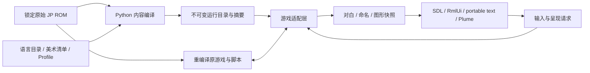

> **Ngôn ngữ / Language:** [Tiếng Việt](native-development.vi.md) · [English](native-development.en.md) · [中文](native-development.md)

# Hướng dẫn phát triển bản địa

Cập nhật: 2026-09-18. Bài viết này mô tả mã nguồn hiện tại và lối vào phát triển; phạm vi hiện tại của các mô-đun chức năng tích hợp được hiển thị trong [Roadmap](../design/mod-roadmap.md), đồng thời các gói bên ngoài và API công khai tạm thời bị treo. Tất cả các đường dẫn đều liên quan đến thư mục gốc của kho lưu trữ.

## Phạm vi hiện có

Mục phát triển là `scripts/Play SRW64 Native.command` → `tools/recomp/run/play_native.py --profile config/recomp/profiles/play-profile.json`. Nó chạy ROM JP Rev 0 gốc bị khóa, với các tập lệnh gốc điều khiển trò chơi và quyền truy cập vào màn hình và đầu vào gốc.

| Khả năng | Việc triển khai hiện tại và những hạn chế |
| --- | --- |
| Đa ngôn ngữ | F7 Nhấn `ja` → `zh-Hans` → `en` để chuyển đổi nóng theo chu kỳ, không có cửa sổ bật lên và ghi nhớ lựa chọn; hội thoại khung đôi tiêu chuẩn và giao diện người dùng gốc mới đã được truy cập. Cả tiếng Trung và tiếng Anh đều bao gồm 4.767 bản nháp giống nhau (4.674 trong số đó là tên, nhãn và lời nhắc hệ thống được mở rộng bởi [danh sách thuật ngữ](../native/localization-terms.md)) và tất cả 244 bản sao chép giao diện người dùng gốc, không phải là bản dịch toàn bộ trò chơi. Nếu thiếu bản dịch, nhấn TextKey hoàn chỉnh để trở về tiếng Nhật. |
| Bản gốc / HD | F6 chuyển đổi giữa mô hình thay thế nghệ thuật thuần túy và mô hình 5600 cùng một lúc; ngôn ngữ, phông chữ, cỡ chữ và độ phân giải không thay đổi khi nhấn F6. |
| Mẫu 5600 | Original vẫn giữ nguyên mẫu tám cạnh ban đầu; HD sử dụng giọt nước GPU gốc theo hồ sơ. Bất kỳ giao diện gói mô hình nào cũng chưa được mở. |
| Kinh nghiệm đọc sách | Bốn cấp độ hướng dẫn hộp thoại tự động, nguyên văn, phân trang, đánh giá, tốc độ/tiến trình và hoạt động; tập lệnh gốc vẫn giữ quyền chuyển tiếp các sự kiện. |
| Khôi phục lưu trữ | SRAM lịch sử được lọc theo Báo cáo hoàn thành, Nhận dạng và tóm tắt ROM, hỗ trợ khôi phục danh sách/rõ ràng; đã xác minh tập một phát qua khởi động nguội để cắt bớt chi tiết và trình điều khiển. Việc tự động lưu các nút an toàn chưa được triển khai, hãy xem [Bản ghi khôi phục](native-save-recovery.md). |
| Lựa chọn nhân vật chính | Trang truyền và trang xác nhận kép (trang SDL/RmlUi) trong cửa sổ trò chơi; không được phép thay đổi tên, tên mặc định được hiển thị bằng ngôn ngữ đọc, xem [Hiển thị ba ngôn ngữ tên mặc định] (../native/default-names.md). Chuyến đi khứ hồi khởi động nguội SRAM không được chấp nhận. |
| Chế độ chơi trò chơi | `gameplay_mods` phải trống. Các lược đồ di động/nhân vật/vũ khí, chỉnh sửa cấp độ, đăng ký loại nội dung và SDK công khai vẫn là các kế hoạch. |
| Nền tảng | Chỉ hỗ trợ macOS: máy chủ đồ họa là SDL2 + RT64/Metal; các trang trong trò chơi (trang tên, cài đặt, trang liên trò chơi và trước chiến tranh) đều là SDL/RmlUi và chỉ mục nhập trên thanh menu mới sử dụng AppKit. Văn bản được sắp chữ bằng công cụ FreeType+HarfBuzz+ICU đa nền tảng. Các nền tảng khác sẽ không được xem xét trong thời điểm hiện tại. |
| Gỡ lỗi | `SRW64_DEBUG=1` Khi máy chủ cung cấp giao diện gỡ lỗi JSON-RPC, dòng lệnh và MCP có thể điều khiển tất cả giao diện gốc và đầu vào của trò chơi, hãy xem [Giao diện gỡ lỗi và MCP] (debug-interface.md). |

**Thoát khỏi vòng đời:** Đăng ký chuỗi trò chơi, dừng cộng tác, chờ đánh thức và tham gia hoàn toàn, sau đó giải phóng RDRAM; tên hiện đại→cửa sổ đóng cốt truyện, cửa sổ đóng trang tên gốc và thoát tự động VI đều được xác minh bởi phiên bản cuối cùng. Xem [Bằng chứng sửa chữa](../native/native-window-close.md) để biết phạm vi mục nhập, lấy mẫu hệ thống bị thiếu và các hạn chế còn lại. Điều này không thay thế việc chấp nhận khôi phục khởi động nguội kho lưu trữ.

## Trách nhiệm mã nguồn và luồng dữ liệu

| Vị trí | Trách nhiệm hiện tại |
| --- | --- |
| `src/srw64_rom/` | Nhận dạng ROM gốc, định dạng tài nguyên/văn bản và codec; được sử dụng bởi recomp, trích xuất dữ liệu và các công cụ nghệ thuật. |
| `src/srw64_native/` | Biên soạn ngoại tuyến thư mục ngôn ngữ, hồ sơ, gói nghệ thuật và tên avatar; xác minh tóm tắt đầu vào và đầu ra. |
| `src/native/localization/` | C++ TextKey, tìm kiếm thư mục, dự phòng văn bản gốc, phông chữ và sao chép giao diện người dùng. |
| `src/native/game_adapter/` | Đã trích xuất nhận dạng nguồn đối thoại và tên gốc codec glyph. |
| `src/native/presentation/` | Yêu cầu hình ảnh gốc/chế độ HD và quyền sở hữu ảnh chụp nhanh danh sách hiển thị. |
| `src/host/host.cpp`, `game_hooks.*` | Máy chủ gốc, quyền truy cập hệ thống N64, lớp phủ/móc tài nguyên và điều khiển VI. |
| `native_dialogue.*`, `native_dialogue_text.cpp` | Trạng thái đọc và bắc cầu hội thoại gốc; xem `src/host/dialogue_scene.cpp` để biết cách sắp chữ và vẽ cảnh trên nhiều nền tảng. |
| `native_name_entry.cpp` / `src/native/ui/name_page.cpp` | Yêu cầu truyền trên chuỗi trò chơi được ghi vào tên mặc định sau trang xác minh ban đầu/truyền và xác nhận RmlUi. |
| `graphics.cpp`, `native_marker.cpp`, `audio.cpp` | Truy cập SDL/RT64, kết xuất GPU giọt nước, thích ứng với thiết bị âm thanh. |
| `window_test_control.hpp`, `src/native/ui/window_test_control.cpp` | Cửa sổ đóng mặc định QA: đóng cửa sổ thực, chia tỷ lệ SDL, yêu cầu chế độ hình ảnh giống như F6; độc lập với các trang được đặt tên. |
| `tools/recomp/run/verification_support.py` | Xác minh quá trình chờ đợi, ghi yêu cầu nguyên tử và thoát khỏi quá trình phân tích cú pháp nhật ký luồng chung cho tập lệnh. |
| `tools/recomp/toolchain/prepare_runtime_lifecycle.py`, `src/host/runtime-support/` | Tạo sự thích ứng thoát khỏi chuỗi/thông báo/lập lịch/bộ hẹn giờ trò chơi cục bộ dựa trên phiên bản ngược dòng cố định, chẩn đoán chuỗi hệ thống bị tắt theo mặc định; mã được tạo và tóm tắt nguồn được viết bằng `build/`. |

Các tệp máy chủ không có thư mục trong bảng đều nằm trong `src/host/` và phần AppKit (`.mm`) nằm trong `src/host/macos/`. 2026-09-18 Máy chủ được di chuyển từ tools/recomp/native-host ban đầu và các tập lệnh của `tools/recomp/` được chia thành các thư mục con tùy theo mục đích sử dụng của chúng:

| Mục lục | Nội dung |
| --- | --- |
| `tools/recomp/toolchain/` | Tạo chuỗi công cụ và mã: `bootstrap.py`, `analyze_layout.py`, `scan_functions.py`, `generate_cpu.py`, kiểm tra ký hiệu và biến thể, `prepare_rt64.py`, `prepare_runtime_lifecycle.py` |
| `tools/recomp/run/` | Máy chủ khởi động và trình điều khiển: `play_native.py`, `run_host_probe.py`, `control_host.py`, nhập mã công khai và xác minh |
| `tools/recomp/verify/` | Xác minh máy thực tế có giới hạn: chế độ hình ảnh, hướng dẫn đọc, giao diện dùng chung, đóng cửa sổ; kiểm tra thực tế của máy về ngôn ngữ, hội thoại và trang tên có trong `tools/recomp/debug/` (`check_localization.py`, `check_dialogue.py`, `check_fast_release.py`, `check_name_entry_ui_switch.py`) |
| `tools/recomp/script_lab/` | Chèn kịch bản, cấp độ nhỏ, đọc kịch bản cảnh và chuyển đổi âm thanh theo hướng dẫn |
| `tools/recomp/gameplay/` | Sửa đổi các tệp quy tắc và chỉnh sửa kho lưu trữ có kiểm soát |
| `tools/recomp/model5600/` | 5600 lưới HD gốc của các điểm đánh dấu bản đồ lô: đóng gói, kiểm tra phát lại tắc nghẽn và xác minh máy thực tế |
| `tools/recomp/probes/` | Đầu dò phát lại Khung/Âm thanh/LZ, Bộ mô phỏng tham chiếu và Ghi RSP |
| `tools/recomp/analysis/` | Phân tích ngoại tuyến các khung hình, kịch bản, chuyển động và so sánh trạng thái |
| `tools/recomp/debug/` | Máy khách phiên giao diện gỡ lỗi, dòng lệnh `srw64ctl.py` và máy chủ MCP, xem [Giao diện gỡ lỗi và MCP](debug-interface.md) |

Các thư mục con cùng nhau tạo thành gói `recomp`: tập lệnh thêm `tools/` vào `sys.path` rồi tham chiếu lẫn nhau dưới dạng `from recomp.toolchain.analyze_layout import ROOT`. Điều này cũng đúng với việc thử nghiệm. Thư mục cấu hình cũng được phân chia: `config/recomp/` chỉ chứa các chuỗi công cụ và cấu hình bản dựng, `profiles/` chứa các tệp dùng thử, `inputs/` chứa các tập lệnh đầu vào cho các lần chạy giới hạn (các cấp độ nhỏ nằm trong `inputs/mini-stages/`), `mini-stages/` chỉ chứa các định nghĩa cấp độ. Dữ liệu đã xuất và nội dung HD nằm ở định dạng `assets/` không được lưu trữ trong thư viện, hãy xem [`assets/README.md`](../../assets/README.md).



Lệnh gọi lại cửa sổ gửi yêu cầu và trường tên được chuỗi trò chơi sử dụng tại cơ hội được xác thực. Chuyển đổi hình ảnh được xác nhận bởi chuỗi kết xuất. Nó đợi cho đến khi hoàn thành khối lượng công việc/hiện tại đã gửi trước khi thay thế công tắc một cách đồng bộ. Đối thoại và các tắc nghẽn được đặt tên được khớp với mỗi khối lượng công việc và các khung hình cũ vẫn đang được hiển thị không thể bị ghi đè bằng "trạng thái mới nhất". Địa chỉ bộ nhớ, nhận dạng lớp phủ và ghi trò chơi tiếp tục thuộc về lớp thích ứng nội bộ và chưa trở thành ABI công khai.

##Thi công và kiểm tra hàng ngày

`make` Lệnh xây dựng từ bản sao mới thành máy chủ trò chơi có thể chạy được (yêu cầu `rom.z64` của thư mục gốc kho), thực hiện theo trình tự:

| Mục tiêu | Chức năng |
| --- | --- |
| `bootstrap` | Sử dụng `PYTHON3` (mặc định `python3`, yêu cầu 3.11+) để tạo `.venv` và cài đặt dự án này; tất cả các bước tiếp theo sẽ được chạy trong `.venv` |
| `recomp-bootstrap` | Nhấn `config/recomp/toolchain.json` để tải xuống phiên bản cố định của phần phụ thuộc ngược dòng và biên dịch N64Recomp, RSPRecomp, n64sym |
| `recomp-layout`, `recomp-scan` | Kiểm tra bố cục ROM, ranh giới chức năng quét |
| `recomp-cpu` | Tạo mã CPU; các ký hiệu ứng cử viên libultra được lấy từ `config/recomp/n64sym-symbols.txt` |
| `host` | `run_host_probe.py --graphics --build-only`: Chuẩn bị RT64, biên dịch `build/recomp/gfx-build/srw64-gfx-host`, không bắt đầu |

Mỗi mục tiêu cũng có thể được chạy độc lập. Không cần ROM, phông chữ hoặc trình mô phỏng để kiểm tra Python cơ bản: `make bootstrap check`.

`run_host_probe.py` sẽ xem xét các biến thể ROM, khả năng tương thích mã, kết quả xây dựng và phiên bản ngược dòng, đồng thời định cấu hình/xây dựng máy chủ nếu cần. Chế độ HD yêu cầu tệp nghệ thuật cục bộ được tham chiếu bởi `content/art/stage1-hd.json` tồn tại và có bản tóm tắt nhất quán. cấu hình mặc định là `images: original`: Bản gốc bắt đầu bằng cách trích xuất hình ảnh gốc từ ROM gốc khi thiếu nội dung HD. Bản sao mới không yêu cầu `assets/`; `--new-game` không dựa vào tệp mật khẩu cục bộ của nhà phát triển. Hiện tại không có gói phân phối được biên dịch trước.

Sau khi `build/recomp/gfx-build` được định cấu hình, chỉ biên dịch và không bắt đầu trò chơi:

```sh
cmake --build build/recomp/gfx-build \
  --target srw64-gfx-host srw64-frame-host -j 6
make recomp-native-check
```

`recomp-native-check` tập hợp các hàng âm thanh, điều khiển mở/điều chỉnh, bắc cầu tên, nội dung, đối thoại đa nền tảng, thoát bộ đếm thời gian, thoát chuỗi trò chơi, phát lại VI, thăm dò trạng thái ngẫu nhiên, chèn tập lệnh, cấp độ nhỏ, quy tắc tùy chọn, sửa lỗi cơ bản, quy tắc trang bị thêm, hoàn tiền ngoài nhóm, hộp mực ảo Link Battler và thử nghiệm giao thức gỡ lỗi, tổng cộng có 18 chương trình thử nghiệm. Trong số đó, 16 chương trình được biên dịch độc lập sử dụng ASan/UBSan và hai chương trình nội dung/đối thoại sử dụng cấu hình CMake hiện tại. Nó không khởi chạy trò chơi, thay thế GPU hoặc chấp nhận cấp độ hoàn chỉnh. Kiểm tra bố cục và tên lịch sử yêu cầu ROM/bản chụp cũ tiếp tục chạy theo tài liệu tương ứng.

Điều chỉnh thời gian chạy không trực tiếp chỉnh sửa thanh toán N64ModernRuntime cố định mà tạo ra các tệp nguồn và bảng kê khai tương ứng trong `build/recomp/runtime-lifecycle/`. Các bản điều chỉnh RT64 được quản lý và cung cấp độc lập bởi `prepare_rt64.py`. Mã viết tay, quy tắc cấu hình và bảng kê khai là mã nguồn; CPU/RSP C đã tạo, bản sao phụ thuộc và nhật ký bản dựng được để lại trong `build/`.

## Xác minh im lặng và kiểm soát cửa sổ

Để kiểm tra máy thực mới, [giao diện gỡ lỗi] (debug-interface.md) được ưu tiên: `srw64ctl.py launch` Sau khi bắt đầu phiên cách ly, bạn có thể nhấn phím, chụp ảnh màn hình, đọc trạng thái và vận hành giao diện gốc mà không cần nhấn phím thủ công. Kênh điều khiển tệp bên dưới tiếp tục phân phát tập lệnh xác thực giới hạn hiện có.

Kiểm tra tương tác có thể sử dụng tham số tắt tiếng mới:

```sh
.venv/bin/python tools/recomp/run/play_native.py \
  --profile config/recomp/profiles/play-profile.json --new-game --mute
```

Theo mặc định, đầu dò tự động bị tắt tiếng và ** không vượt qua `--audio`** trong quá trình thử nghiệm; ngoại lệ là khi cần phân biệt các hướng dẫn biểu diễn chỉ có các âm thanh khác nhau (xem thao tác âm thanh của [mini-stage] (../script/mini-stage.md)). Tại thời điểm này, cửa sổ mua lại phải được đưa ra cùng một lúc. Quá trình hoàn chỉnh của trang tên được điều khiển bởi giao diện gỡ lỗi, xem [Nhập tên bản địa](../native/native-name-entry.md#Verification and proof). Các tuyến phím nhấn N64 cũ không thể điền vào các trường gốc; quay lại tuyến đường cũ phải sử dụng `--original-name-entry` một cách rõ ràng. So sánh cửa sổ đóng của giao diện người dùng tên gốc có thể sử dụng `verify_window_close.py --run RUN --at-vi 1350`, điều này cũng yêu cầu `SRW64_WINDOW_CONTROL=1`.

| Công tắc/Tài liệu | Trách nhiệm và Định dạng |
| --- | --- |
| `SRW64_WINDOW_CONTROL=1` / `window-close.txt` | `SRWX1 sequence at_vi`; Sau khi đến VI, hãy gọi `NSWindow.performClose` thật và ghi `window-close-events.jsonl`. |
| Công tắc tương tự / `window-control.txt` | `SRWW1 sequence width height`; Chuỗi cửa sổ gọi thay đổi kích thước SDL, cho phép 640–2560 × 480–1600. |
| Công tắc tương tự / `image-control.txt` | `SRWI1 sequence original或hd`; chia sẻ đường dẫn yêu cầu với F6. |
| `SRW64_SHUTDOWN_TRACE=1` | Trong macOS, số lượng luồng trò chơi trước và sau khi phát hành RDRAM sẽ được ghi lại. Nó chỉ dùng để chẩn đoán và không thay đổi trình tự thoát. |
| `control.txt` | `control_host.py` Gửi yêu cầu đầu vào/ra N64 và máy chủ xử lý yêu cầu đó dưới dạng VI và ghi lại sự kiện. |
| `SRW64_SCRIPT_INJECT=1` / `script-inject.txt` | `SRWJ1 sequence at_vi hex`; `script_debug.py` Viết tập lệnh sự kiện tùy chỉnh vào vùng lưu trữ tạm thời `807F0000`. Khi bản đồ chiến thuật không hoạt động, nó sẽ được thực thi bởi công cụ tập lệnh gốc và sự kiện sẽ được ghi vào `script-inject-events.jsonl`. Xem [Gỡ lỗi chèn tập lệnh](../script/script-debug-injection.md). |
| `SRW64_MINI_STAGE=<image.json>` | `mini_stage.py compile` Đã tạo hình ảnh cấp độ nhỏ; ghi lại bộ đệm sự kiện, khối bản ghi sắp xếp và bảng con trỏ của cảnh này khi đăng ký cảnh (`8009DE7C`), viết lại chỉ mục bản đồ sau `80209D6C`; nhấn F8 (hoặc `SRW64_MINI_STAGE_ARM_VI`) trên menu chính để chuyển trực tiếp sang chế độ cảnh 12 (`SRW64_MINI_STAGE_DIRECT=0` lấy trò chơi mới cũ + đường dẫn mở đầu); `SRW64_MINI_STAGE_COMPILER` được sử dụng để tải các tệp nguồn cấp độ khi chạy. Sự kiện được ghi vào `mini-stage-events.jsonl`. Xem [mini-stage](../script/mini-stage.md). |
| `SRW64_MINI_STAGE_CAPTURE=1` | Hợp tác với `SRW64_STATE_PROBE=1`: Mỗi ranh giới lệnh của sự kiện thay thế cấp độ nhỏ lưu trữ ảnh chụp nhanh khu vực `state-N-mini-stage-command.json` (`argument` là phần chênh lệch so với khối sự kiện), do đó, các hướng dẫn ghi trường được hoàn thành trước 0 VI và không có thay đổi màn hình nào cũng có thể có quyền kiểm soát trước và sau. Lưu trữ tập lệnh PC chỉ đọc. Xem [mini-stage](../script/mini-stage.md). |
| `SRW64_MINI_STAGE_EXIT_AFTER=<操作码>` | Mã lệnh hex. Sau khi đạt được opcode trong sự kiện được thay thế, quá trình chạy sẽ kết thúc sau thời gian gia hạn và không còn tiêu tốn ngân sách VI nữa. Để xác minh một hướng dẫn, chỉ cần có đoạn trước và sau nó. |
| `SRW64_MINI_STAGE_EXIT_GRACE=<vi>` | Số lượng Grace VI ở trên, mặc định là 300: cho phép hiệu ứng của lệnh này và một số khung hình tiếp theo vẫn được ghi lại. |
| `SRW64_RULE_FIXES=<id,…>` | Đã bật sửa đổi quy tắc tùy chọn khi khởi động (xem `rule_settings.RULE_FIXES` để biết ID); nó có thể được thay đổi trong quá trình thao tác thông qua thanh menu "Tùy chọn → Điều chỉnh lối chơi" hoặc cửa sổ cài đặt. ID không xác định khiến khởi động không thành công. Máy chủ ghi `rule-fixes.json` và bản ghi báo cáo `rule_fixes`. Để dùng thử `play_native.py --rules/--rule-fixes`. Xem [Sửa quy tắc tùy chọn](../gameplay/rule-fixes.md). |
| `SRW64_RULE_SETTINGS=<rules.json>` | Tệp cài đặt (lược đồ `srw64.rule-settings.v1`) được ghi lại sau khi thực hiện thay đổi đối với "Tùy chọn → Điều chỉnh cách chơi" hoặc cửa sổ cài đặt trong trò chơi; được chuyển từ `play_native.py` qua `run_host_probe.py --rule-settings`. Nếu không được đặt, các thay đổi sẽ chỉ có hiệu lực trong lần chạy này. |
| `SRW64_WINDOW_CONTROL=1` / `rule-control.json` | `{"schema":"srw64.rule-control.v1","sequence":N,"item":"<规则 ID｜defaults｜original｜all>"}`; Nhấn mục tương ứng trong menu, kết quả cũng như trạng thái kiểm tra của tất cả các mục sẽ được ghi bằng `rule-menu-events.jsonl`. |
| `SRW64_WINDOW_CONTROL=1` / `settings-control.json` | `{"schema":"srw64.settings-control.v1","sequence":N,"action":"open｜close｜press","id":"rule:<ID>｜preset:<键>｜locale:<语言>｜images:<original｜hd>"}`; Cửa sổ cài đặt vận hành, kết quả và tất cả trạng thái điều khiển được ghi vào `settings-window-events.jsonl`. Xem [Cửa sổ cài đặt](../native/settings-window.md). |
| `SRW64_RULE_PROBE=1` | Khi nó dừng ở `3D38` lần đầu tiên và cả đơn vị địch và quân bạn đều có đơn vị, hãy sử dụng từng bộ quy tắc để gọi hai hàm tỷ lệ trúng đích và viết `rule-probe.jsonl`; sau đó viết `rule-calls.jsonl` cho mỗi lệnh gọi của hai hàm. |
| `SRW64_MSAA=<0｜2｜4｜8>` | Số lượng mẫu để khử răng cưa đa mẫu RT64, mặc định là 4 (từ 24-09-2026); RT64 tự động quay trở lại khi thiết bị không hỗ trợ và nhật ký máy chủ ghi lại `SRW64_MSAA samples=N`. Các đường dẫn dành cho lưới, bảng tên, bản nhạc, bản đồ chiến thuật và hình đại diện gốc đều tuân theo số lượng mẫu của đối tượng cảnh. `0` bị đóng để so sánh với ảnh chụp màn hình cũ. |
| `SRW64_DEBUG=1` / `debug.json` | Giao diện gỡ lỗi: Máy chủ giám sát TCP vòng lặp cục bộ, cổng và mã thông báo được ghi bằng `debug.json` của thư mục đang chạy, một JSON-RPC 2.0 trên mỗi dòng (trạng thái, bàn phím trò chơi, bộ điều khiển, ảnh chụp màn hình, nhấp chuột/phím/đầu vào giao diện gốc, menu, cài đặt, cửa sổ, thoát). Thường được sử dụng thông qua `tools/recomp/debug/srw64ctl.py` hoặc MCP, xem [Giao diện gỡ lỗi và MCP](debug-interface.md). |
| `SRW64_AUDIO_CAPTURE_FROM/_TO=<vi>` | Giới hạn việc thu thập chẩn đoán `--audio` ở VI này (mặc định chỉ là 30 giây đầu tiên sau khi âm thanh được bật, điều này vô dụng đối với các lệnh xuất hiện sau vài phút). Hoạt động âm thanh giới hạn ở cấp độ nhỏ phải được đặt `_TO`. Xem `Srw64AudioCaptureWindow` của `audio_timing.hpp` để biết logic cửa sổ; âm thanh phát ra không bị ảnh hưởng. |

Mỗi giao thức duy trì độc lập số thứ tự tăng dần; một thư mục đang chạy chỉ sử dụng một trình điều khiển và tệp tạm thời được ghi và thay thế hoàn toàn về mặt nguyên tử. Các trình khởi chạy thông thường không chủ động kích hoạt các công tắc QA này và các biến môi trường cho phép gỡ lỗi chỉ ảnh hưởng đến các lệnh kiểm tra tương ứng.

## Cách đọc kết quả và bằng chứng

| Sản phẩm | Cách sử dụng |
| --- | --- |
| `RUN/report.json` | Mã thoát máy chủ thực tế, mã nguồn ROM/nhị phân/viết tay/tóm tắt thích ứng phụ thuộc, trạng thái âm thanh, nguồn đầu vào và lưu. |
| `RUN.native.log` | Nhật ký máy chủ ở cùng cấp độ với RUN; sự kiện thoát cửa sổ, chẩn đoán và lỗi. |
| `RUN/live-state.json`, `control-events.jsonl` | Liệu VI hiện tại, yêu cầu đầu vào đã được áp dụng hay chưa. |
| `RUN/present-*.png/json`, `dialogue-raster.json` | Khung GPU và chế độ/kích thước của nó cũng như việc sắp chữ văn bản gốc tương ứng đã được hoàn thành. |
| `RUN/runtime-data/saves/` | SRAM cho hoạt động cách ly này; lịch sử dùng thử thông thường ở `build/recomp/profile-play/sessions/`. |

Bản dùng thử tương tác được đặt mặc định là `light` và việc xuất RAM GPU/8 MiB định kỳ không được thực hiện; thăm dò giới hạn mặc định là `full`. Nếu kết quả đang chạy thiếu ảnh chụp màn hình, trước tiên hãy xác nhận chế độ chẩn đoán. Danh sách luồng chẩn đoán trống có nghĩa là ranh giới không được quan sát và không bằng số lượng luồng bằng 0.

Trạng thái CLI của `run_host_probe.py` phản ánh liệu đầu dò có đáp ứng yêu cầu hay không: đóng cửa sổ sớm có thể trả về 1, trong khi `report.json.exit_code` vẫn bằng 0. Cả hai đều không chứng tỏ độ an toàn trong suốt vòng đời của luồng; Xác thực được đặt tên hiện ghi nhật ký rõ ràng `shutdown_lifecycle_verified: false` và liệt kê riêng các quan sát chẩn đoán.

##Kết thúc bài kiểm tra và sắp xếp không gian làm việc

Khi kết thúc một bài kiểm tra vẫn đang chạy, hãy ưu tiên đóng cửa sổ trò chơi của nó hoặc thực hiện thao tác sau trên thư mục đang chạy đã được xác nhận:

```sh
.venv/bin/python tools/recomp/run/control_host.py RUN --quit
```

Đợi `report.json` và quá trình kết thúc. Nếu quá trình bị kẹt, trước tiên hãy kiểm tra lệnh của PID, tiến trình mẹ và thư mục làm việc, sau đó chỉ chấm dứt PID được xác nhận thuộc về thử nghiệm này và giữ nhật ký thời gian chờ/ngoại lệ. Không sử dụng `killall Python`, `killall node` hoặc tắt tiến trình theo toàn bộ đường dẫn không gian làm việc; công cụ Codex cũng có thể sử dụng thư mục này làm thư mục làm việc.

`active.lock` là tệp `flock`. Sự tồn tại của tệp không có nghĩa là tiến trình vẫn giữ khóa. Đừng dựa vào việc xóa các tập tin khóa để giải quyết xung đột đang chạy.

Các thư mục chạy một lần trong `build/` (các phiên trong `qa/`, `debug/`, các đầu ra thăm dò khác nhau) chỉ là bằng chứng xử lý và kết luận có thể bị xóa sau khi được ghi vào tài liệu; nhưng không nói chung `git clean` hoặc xóa `build/`: `build/recomp/profile-play/` Đó là cài đặt lưu và ghi nhớ dùng thử, `upstream/`, `gfx-build/` và việc xây dựng lại mã được tạo rất chậm. `__pycache__` / `.pyc` trong thư mục mã nguồn có thể bị xóa sau khi hoàn tất kiểm tra; `egg-info` được tạo bởi quá trình cài đặt Python có thể chỉnh sửa là siêu dữ liệu cài đặt cục bộ, vì vậy bạn chỉ cần bỏ qua nó.