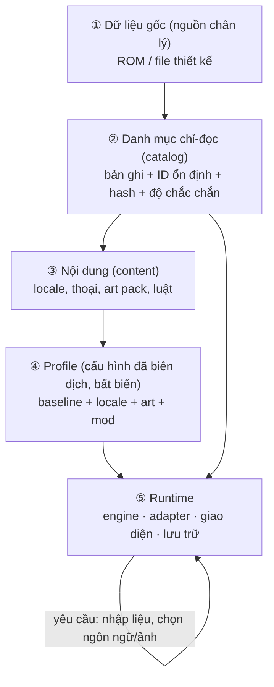

# 01 — Kiến trúc tổng thể

## 1.1 Năm tầng

SRW64 tách rất rõ *dữ liệu gốc → danh mục đọc được → nội dung → cấu hình → chạy*. Đó là lý do nó mở rộng được (đa ngôn ngữ, HD, luật tuỳ chọn) mà không phá lõi.



| Tầng | SRW64 🔍 | Game mới 🧭 |
| --- | --- | --- |
| ① Dữ liệu gốc | `rom.z64` khoá bằng SHA-256, [bản đồ bảng](../../docs/data/original-data-catalog.en.md) trong `config/data/original-jp-v1.json` | Thư mục `data/` do bạn viết (JSON), khoá bằng manifest |
| ② Danh mục | `assets/original-data/records/` sinh bởi `extract_original.py`, mỗi bản ghi có `raw_hex`, địa chỉ, hash | `build/catalog/` sinh bởi `compile_content.py` từ `data/` |
| ③ Nội dung | `content/locales/*.json`, `content/dialogue/<lang>/`, `content/art/*.json` | giữ nguyên cấu trúc này |
| ④ Profile | `config/recomp/profiles/play-profile.json` (`srw64.play-profile.v1`) | `config/profiles/default.json` |
| ⑤ Runtime | host C++ + hook; **adapter** nối với game gốc | engine + adapter mỏng (nếu nối với hệ thống ngoài) |

### Quy tắc "profile bất biến"
Trước khi chạy, profile được **biên dịch và đóng băng** (kiểm hash từng tệp). Chạy xong không sửa ngược lại dữ liệu. Chuyển ngôn ngữ/ảnh lúc chạy chỉ đổi *con trỏ* sang danh mục bất biến khác (F6/F7 ở SRW64).

## 1.2 Nguyên tắc ID ổn định (quan trọng nhất)

> [!IMPORTANT]
> **ID là hợp đồng.** Mọi thứ khác (tên, ảnh, thoại, lưu game) tham chiếu ID. SRW64 giữ nguyên số gốc dù đã dịch/khử trùng tên: *"Identities such as characters and weapons retain their original numbers and cannot be deduplicated or renumbered according to their translated names."*

| Quy tắc | Lý do |
| --- | --- |
| ID là số nguyên (hoặc slug) **không bao giờ tái sử dụng** | Lưu game, MOD, thoại tham chiếu |
| Không đánh số lại khi xoá | Thêm cờ `deprecated`, giữ chỗ |
| Tên hiển thị tách khỏi ID (`name_key` → bảng văn bản) | Đổi tên/dịch không đụng dữ liệu |
| Nhiều actor được phép **dùng chung** một bản ghi chỉ số | SRW64: 361 danh tính nhưng chỉ 264 gắn chỉ số riêng |
| Ánh xạ là bảng riêng (actor→pilot, actor→spirit, actor→voice) | Tránh dùng `actor_id` làm chỉ số mảng — bẫy đã gặp ở SRW64 |
| Bản ghi giữ cả **giá trị gốc lẫn độ chắc chắn** (`confidence`) | Biết trường nào đã xác nhận, trường nào còn đoán |

## 1.3 Tĩnh và động: *bản ghi* vs *thể hiện*

SRW64 tách **bản ghi tĩnh** (ROM, không đổi) khỏi **thể hiện lúc chạy** (trạng thái của từng quân).

| | Bản ghi tĩnh (record) | Thể hiện lúc chạy (instance) |
| --- | --- | --- |
| Máy | 36 byte (HP, EN, giáp…) | 84 byte: trạng thái, **số bậc cải tạo**, HP hiện tại, con trỏ phi công |
| Phi công | 16 byte (6 chỉ số, SP) | 76 byte: cấp, kinh nghiệm, tinh thần đã học, số lần hạ gục |
| Vũ khí | 16 byte | 36 byte: **số bậc cải tạo**, loại cải tạo, đạn |

**Chỉ số hiện tại được *tính lại* từ bản ghi tĩnh + số bậc**, không lưu trực tiếp (`800A5254` — hàm tính lại duy nhất của toàn game). Lưu game chỉ giữ các **bậc** (mỗi bậc 4 bit). 🧭 Áp dụng nguyên xi:

```text
chỉ_số_hiện_tại = f(bản ghi tĩnh, bậc cải tạo, cấp phi công, tinh thần/kỹ năng đang bật)
lưu game = { bậc, cấp, kinh nghiệm, cờ trạng thái } — KHÔNG lưu chỉ số đã tính
```

Lợi ích: sửa cân bằng (đổi `units.json`) có hiệu lực cho cả file lưu cũ; không lệch giữa giao diện và tính toán.

## 1.4 Tách lõi / trình bày / nền tảng

| Lớp | Ví dụ ở SRW64 🔍 | Quy ước |
| --- | --- | --- |
| Lõi miền | `src/srw64_rom/`, `src/srw64_native/` | không I/O, không phụ thuộc OS, có test |
| Adapter | `src/native/game_adapter/` | duy nhất chỗ biết cấu trúc hệ thống ngoài |
| Trình bày | `src/native/presentation/`, UI RmlUi | nhận *snapshot* trạng thái, trả *yêu cầu* |
| Nền tảng | `src/host/macos/`, đường dẫn Windows/POSIX | cô lập theo OS |

**Luồng yêu cầu:** giao diện *không ghi thẳng* trạng thái game. Nó đẩy "yêu cầu" (đổi ảnh, chọn tên); luồng game xác nhận ở thời điểm an toàn. Quy tắc luồng: *"cửa sổ gửi yêu cầu, trường tên được luồng game dùng ở thời điểm đã xác thực."*

## 1.5 Sơ đồ thư mục khuyến nghị cho game mới

```text
my-game/
├─ data/                      # ① dữ liệu thiết kế (nguồn chân lý)
│   ├─ actors.json  pilots.json  units.json  weapons.json
│   ├─ spirits.json skills.json  terrain.json
│   └─ rules/upgrade-rules.json
├─ scenes/                    # kịch bản: mỗi cảnh một tệp
│   ├─ campaign.json
│   └─ scene-001.json …
├─ content/
│   ├─ locales/   vi.json en.json ja.json       # tên, nhãn, hệ thống
│   ├─ dialogue/<lang>/story/scene-001.txt     # thoại cốt truyện
│   ├─ dialogue/<lang>/battle/voice-003.txt    # thoại chiến đấu
│   └─ art/       manifest.json                 # danh mục ảnh
├─ art/                       # ảnh nguồn (xem 04)
├─ config/profiles/default.json                 # ④ profile
├─ tools/ (compile_content.py, validate_content.py, export_*.py)
├─ tests/
└─ docs/                      # theo project-kit
```
