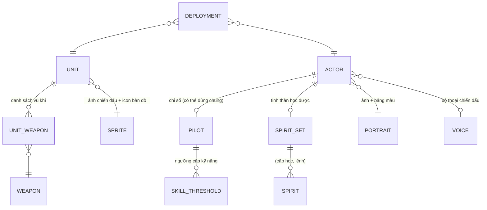

# 02 — Xây dựng nhân vật, máy, vũ khí

> Nguồn 🔍: [Danh mục dữ liệu gốc](../../docs/data/original-data-catalog.en.md), [Giới hạn cải tạo](../../docs/gameplay/upgrade-limits.en.md), [Công thức chiến đấu](../../docs/gameplay/battle-formulas.en.md), [Sổ lỗi gốc](../../docs/gameplay/original-bug-register.en.md).

## 2.1 Mô hình thực thể



Điểm sâu nhất: **ACTOR (danh tính) ≠ PILOT (chỉ số) ≠ UNIT (máy)**. Phối hợp thành *đội hình* chỉ ở thời điểm triển khai/đăng ký (`DEPLOYMENT`), nên cùng một phi công lái nhiều máy, một máy nhiều dạng.

## 2.2 ACTOR — danh tính 🔍

SRW64: 361 danh tính. Tên ngắn (`4382+id`), tên đầy đủ (`4743+id`) lấy từ bảng văn bản.

| Trường | Ý nghĩa |
| --- | --- |
| `id` | ổn định, không tái dùng |
| `name_key` / `full_name_key` | khoá văn bản (không nhúng chuỗi vào dữ liệu) |
| `pilot` | id bản ghi chỉ số (hoặc `null` nếu chỉ là NPC thoại) |
| `spirits` | id bộ tinh thần |
| `portrait` | `{image, palette}` — **hai** số, không suy ra từ `id` |
| `voice` | id bộ thoại chiến đấu (`-1`/`null` = không thoại) |

> [!WARNING]
> **Bẫy thật ở SRW64:** `actor_id` *không* dùng trực tiếp làm chỉ số mảng của bảng chỉ số. Bảng danh tính 361 dòng nhưng bảng ánh xạ chỉ 360; nhân vật 284 (クェス) ánh xạ vào bản ghi 256 — **vượt biên** và đọc trúng bảng tinh thần kế bên → kỹ năng NT cấp 9 tính ra từ byte lạ. Bài học: **đặt ô kiểm biên tại mọi lần tra bảng** và để validator bắt lỗi.

Dùng chung bản ghi: nhiều actor có thể trỏ cùng `pilot` (nhân vật nhân bản/nhiều phiên bản). Sửa một bản ghi ảnh hưởng tất cả — công cụ chỉnh sửa phải **cảnh báo người dùng chung**.

## 2.3 PILOT — chỉ số phi công 🔍

| Trường | Ý nghĩa | Ghi chú SRW64 |
| --- | --- | --- |
| `melee` (格闘), `ranged` (射撃), `evasion` (回避), `hit` (命中), `reaction` (反応), `skill` (技量) | 6 chỉ số cơ bản | byte `+1..+6` |
| `sp_max` | điểm tinh thần tối đa | byte `+C` |
| `growth` | mỗi cấp: cận chiến/xạ kích/phản ứng/kỹ năng **+1**; né/trúng/SP tối đa **+2** | hàm tăng cấp `800A6238` |
| `skill_flags` | 7 kỹ năng đã giải mã: `01` cắt (切り払い), `02` S‑phòng thủ, `04` cơ bản, `08` NT, `10` cường hoá thế giới, `20` thánh chiến sĩ, `40` siêu năng lực | `+0xF` |
| `skill_thresholds` | 3 nhóm × 10 byte (chỉ đọc 9); cấp kỹ năng = số ngưỡng thoả `0 < ngưỡng ≤ cấp` | nhóm 1↔mask `7C`, nhóm 2↔`01`, nhóm 3↔`02` |

🧭 Với game mới, biểu diễn thẳng bằng JSON dễ đọc:

```json
{
  "id": 18,
  "stats": {"melee": 120, "ranged": 118, "evasion": 112, "hit": 125, "reaction": 130, "skill": 110},
  "sp_max": 60,
  "growth": {"melee": 1, "ranged": 1, "reaction": 1, "skill": 1, "evasion": 2, "hit": 2, "sp_max": 2},
  "skills": {"NT": [1, 4, 8, 12, 18, 24, 30, 38, 45], "cut": [12, 20]},
  "spirits": [{"level": 1, "spirit": "focus"}, {"level": 8, "spirit": "strike"}]
}
```

Quy tắc phi công 🧭:
- Cấp kỹ năng = số ngưỡng thoả điều kiện; **sắp xếp ngưỡng hợp lệ** khi hiển thị (xử lý ngưỡng 0, không tăng dần, nhiều cấp cùng lúc).
- Không giải thích byte cuối nhóm nếu chưa có bằng chứng — **giữ nguyên, ghi `confidence: unknown`**.

## 2.4 SPIRIT — tinh thần 🔍

- Mỗi actor có **6 cặp (cấp học, mã lệnh)**; 148 bản ghi, 30 lệnh trong bảng gốc.
- Tên lệnh = `969 + command_id`. Lệnh 0 = tự huỷ, 29 = hồi sinh (ví dụ quy ước mã đặc biệt).
- Hiệu lực dạng **bitmap + thời lượng** (xem [Công thức chiến đấu](../../docs/gameplay/battle-formulas.en.md)): *魂 ×3 sát thương, 熱血 ×2, 鉄壁 giáp ×2…* → mỗi tinh thần là một bit trạng thái với thời hạn (lượt/trận).

```json
{ "id": "strike",  "name_key": "spirit.strike",  "sp_cost": 40, "effect": {"damage_mult": 2.0},  "duration": "next_attack" }
{ "id": "iron_wall","name_key": "spirit.ironwall","sp_cost": 30, "effect": {"armor_mult": 2.0},   "duration": "this_enemy_phase" }
```

## 2.5 UNIT — máy 🔍

| Trường | Ý nghĩa | Offset (SRW64) |
| --- | --- | --- |
| `hp`, `en` | cơ bản | `+0`, `+2` |
| `mobility` | tốc độ di chuyển (map) | `+6` |
| `maneuver` (運動性) | né tránh | `+8` |
| `armor` | giáp | `+A` |
| `limit` (限界) | ngưỡng hiệu suất | `+C` |
| `repair_cost` | phí sửa | `+0x14` |
| `terrain_rank` | **4 hạng**: không/đất/biển/vũ trụ | `+14..+17` |
| `upgrade_cap` | trần cải tạo 6–15 (**"vịt con xấu xí"**) | `+0x20` |
| `special_bits` | bit khả năng đặc biệt (+0x1C u32), trang bị (+0x18 u8) | 22 loại, 429 liên kết |
| `weapons` | danh sách vũ khí | bảng riêng |

**"Vịt con xấu xí":** máy mạnh chỉ cải tạo tới bậc 7, máy yếu/hàng loạt tới 13–15 → sau cải tạo đủ có thể vượt máy mạnh. Mọi nâng cấp (5 chỉ số + *mỗi vũ khí*) dùng chung **một byte trần**. Đây là đòn bẩy cân bằng rất rẻ; 🧭 nên giữ.

Hạng địa hình dùng bảng nhân: `-/D/C/B/A → 0/60/80/100/120%`, **nhân** chứ không cộng (vũ khí A + máy A ⇒ ×1,44). Phía máy lấy **tổng hạng máy + hạng phi công** rồi chia mốc (`0→0%, 1–3→60%, 4–5→80%, 6–7→100%, ≥8→120%`).

```json
{
  "id": 36,
  "name_key": "unit.swimmurg",
  "hp": 4500, "en": 180, "mobility": 6, "maneuver": 95, "armor": 1300, "limit": 120,
  "size": "M", "move_type": "air",
  "terrain_rank": {"air": "A", "land": "-", "sea": "-", "space": "A"},
  "upgrade_cap": 12, "repair_cost": 4200,
  "special": ["barrier"],
  "weapons": [{"weapon": 160, "forms": [36]}, {"weapon": 161, "forms": [36, 37]}]
}
```

`weapons[].forms`: danh sách "dạng" áp dụng (SRW64: 5 ô dạng). **Khớp dạng ≠ đủ điều kiện dùng**; danh sách có thể gồm vũ khí của dạng khác — hiển thị riêng, đừng coi là menu vũ khí hiện tại.

## 2.6 WEAPON — vũ khí 🔍

| Trường | Ý nghĩa | Ghi chú |
| --- | --- | --- |
| `power` | công suất (lưu ×100) | `+1 × 100` |
| `range` | `[min, max]` | `+2/+3` |
| `hit_mod` | hiệu chỉnh trúng (**có dấu**) | `+4` |
| `ammo` | số đạn; `-1` = vô hạn / cờ "không bom" | `+5` (FF) |
| `en_cost`, `will_required` | tiêu EN, khí lực tối thiểu | `+6/+7` |
| `terrain_rank` | 4 hạng | `+9..+12` |
| `crit_mod` | hiệu chỉnh chí mạng (có dấu) | `+D` |
| `upgrade_type` | **0–4**: 0 = không cải tạo; 1–4 = bốn đường cong | `+0E` |
| `melee_flag` | bit 0x80 ở `+4`: dùng *cận chiến* thay vì *xạ kích* | quyết định công thức |
| `name_key`, `menu_name_key` | tên thuần / tên menu (kèm ký hiệu *grid/shooting/P*) | giữ nguyên ký hiệu gốc |

Quy tắc: **không suy luận hành vi từ tên**. Một vũ khí không được tham chiếu bởi danh sách nào **không** có nghĩa là xoá được.

```json
{ "id": 160, "name_key": "weapon.beam_saber", "power": 2600, "range": [1, 1], "hit_mod": 10,
  "ammo": -1, "en_cost": 10, "will_required": 100, "crit_mod": 5,
  "terrain_rank": {"air": "B", "land": "A", "sea": "B", "space": "A"},
  "upgrade_type": 2, "attack_stat": "melee" }
```

## 2.7 Cải tạo (upgrade) — hệ thống đường cong 🔍

**5 chỉ số máy** (HP, EN, mobility, armor, limit) mỗi cái một đường cong 15 bậc; **4 loại vũ khí** mỗi loại một đường cong và bảng giá.

| Chỉ số | Bậc 1–5 | Bậc 6–15 |
| --- | --- | --- |
| HP | +200/bậc | +200/bậc |
| EN | +10 | +20 |
| Mobility | +5 | +10 |
| Armor | +100 | +150 |
| Limit | +10 | +20 |

Giá HP: `2000, 4000 … 30000` (tăng 2000/bậc). Trần 15 → HP +3000 tổng. **Giá độc lập với máy và trần** — chỉ phụ thuộc "đang ở bậc nào".

Vũ khí loại 1: `100,100,150,150,200,200,200,200,200,250,250,250,250,250,300` (tổng +3050); loại 2: …(+2900); loại 4: …(+2600).

🧭 Dạng JSON (đã dùng ở SRW64 như `srw64.upgrade-rules.v1`):

```json
{
  "schema": "mygame.upgrade-rules.v1",
  "stats": {"hp": {"increments": [200,200,200,200,200,200,200,200,200,200,200,200,200,200,200],
                   "prices": [2000,4000,6000,8000,10000,12000,14000,16000,18000,20000,22000,24000,26000,28000,30000]}},
  "weapon_types": {"1": {"increments": [], "prices": []}},
  "unit_caps": [{"id": 36, "cap": 12}],
  "weapon_type_overrides": [{"id": 19, "type": 2}]
}
```

Quy tắc kiểm định (bài học SRW64): đường cong đúng 15 phần tử; mỗi bước 0–9999; tổng ≤ 30000 (u16); giá 1–99998 (0 và 99999 là *sentinel*); trần 5–15; **trường lạ luôn báo lỗi**.

**Hai "trần":** *trần hiệu lực* (dùng cho màn cải tạo) vs *trần gốc* (dùng cho thay-máy, vũ khí thêm khi cải tạo đủ, giá bán). Khi cho phép phá trần, các hệ thống kia vẫn phải đọc *trần gốc*.

## 2.8 Tăng cấp & công thức tổng hợp

```text
cấp k (1..)           : stats += growth theo từng cấp
kỹ năng               : đếm ngưỡng thoả
SP tối đa             : sp_max + 2·(cấp-1)
chỉ số hiện tại       : tính lại duy nhất qua một hàm (xem 01 §1.3)
```

**Một hàm tính lại duy nhất** = nguồn sự thật duy nhất. Giao diện, màn cải tạo, thư viện, battle viewer cùng đọc hàm này → *"không có chuyện một số trên giao diện, một số ở tính toán."*

## 2.9 Quy trình thêm một nhân vật mới (🧭)

1. Thêm `pilot` (chỉ số) → 2. thêm `actor` (danh tính + ánh xạ) → 3. chọn/thêm `unit` + `weapons` → 4. ảnh (chân dung, icon, ảnh chiến đấu) vào `art/manifest.json` → 5. tên/nhãn vào `locales/*.json` → 6. thoại chiến đấu `voice` → 7. đặt vào `deployment` của cảnh → 8. chạy `validate_content.py` → 9. kiểm chứng trong màn mini (xem 05).

Checklist độ sâu cho mỗi nhân vật: có tinh thần riêng? ngưỡng kỹ năng? hạng địa hình hợp lý? thoại chiến đấu cho cả 9 tình huống? có thoại điều kiện với đối thủ/đồng đội đặc biệt? ảnh có đủ 3 cỡ?
