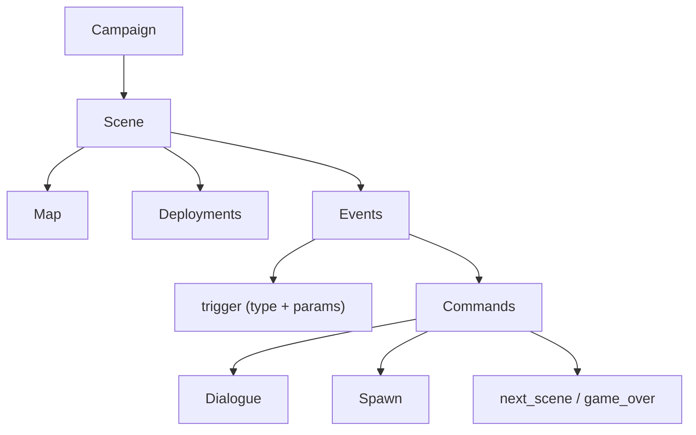

# 05 — Quản lý cốt truyện & kịch bản màn chơi

Ký hiệu: 🔍 = quan sát được ở SRW64 · 🧭 = khuyến nghị cho game mới.

## 1. Mô hình Scene → Event → Command

🔍 SRW64: 142 slot màn / 131 bảng entry / 1.812 event / 67.160 lệnh / 33.582 tham chiếu thoại / 2.678 khối điều kiện. Có 73 lệnh thường, 30 lệnh điều kiện (`3E00–3E1D`), 12 marker ngữ cảnh (`3DD0–3DDB`), 15 loại event. Mỗi event = header (`type` + 4 tham số) + chuỗi lệnh, kết thúc `FFFF`.
Tên chương = text `281 + chỉ số màn`. Bảng scene→map: `802195B0[scene×2]`.



## 2. Loại trigger

🔍 Các loại event: 0 đầu lượt · 1 đếm trễ · 2 đơn vị bị hạ · 3 HP% ≤ ngưỡng · 4/5 sau/trước chiến đấu · 6 diệt hết địch · 7 phe còn ≤ N · 8 vào vùng (cần `3D57`) · 9 thuyết phục · 12 mở màn · 13 bố trí ban đầu · 14 kết màn.

🧭 Đặt tên trigger bằng chuỗi thay vì số: `turn_start`, `unit_defeated`, `hp_below`, `after_battle`, `all_enemies_defeated`, `faction_remaining`, `area_enter`, `persuade`, `opening`, `deploy`, `ending`.

## 3. Lệnh chủ chốt

| 🔍 Mã | Ý nghĩa | 🧭 Tên gợi ý |
|---|---|---|
| `3D38` | chờ | `wait` |
| `3D39`/`3D3A` | SFX / BGM | `sfx`, `bgm` |
| `3D3E–3D43` | các chế độ hội thoại | `say` + `mode` |
| `3D44` | lựa chọn (slot, số lựa, text id; kết quả ở `+0x994`) | `choice` |
| `3D45` | nhóm triển khai | `deploy_group` |
| `3D4A` / `3D4C` | thắng / thua | `victory`, `game_over` |
| `3D4B n` | sang màn n (500 = hồi phục) | `next_scene` |
| `3D5A` | thêm/bớt roster (word4 ≥2000: 2000 phi công, 3000 máy, 4000 cả hai) | `roster_add/remove` |
| `3D5B` | tiền | `funds` |
| `3D62` | đổi danh tính | `change_identity` |
| `3D6C` | đặt cấp nâng cấp | `set_upgrades` |
| `3D65` | text thắng/thua (5567+n / 5593+n) | `show_objective` |
| `3D71` | ending (chỉ overlay bản đồ thế giới) | `ending` |

## 4. Biến, tuyến truyện, lựa chọn

🔍 200 biến script 2-bit (`8015E818`); 100–114 và 128–139 reset về 3 mỗi màn. Marker tuyến: `3DD1–3DD4` = 4 tuyến nhân vật chính; `3DD5/6` real/super; `3DD7/8` nam/nữ; `3DD9–3DDB` kết quả lựa chọn; `3E10–3E12` kiểm tra kết quả. Người nói = 3 chữ số đầu của header text 8 byte (25–32 là tương đối theo tuyến).

🧭 Khuyến nghị: dùng biến **có tên, có kiểu** (`flag`, `counter`), phạm vi `scene` hoặc `campaign`, khai báo trong `variables`; tuyến truyện là một `route` đặt sẵn, không mã hoá bằng số. Giới hạn 2-bit của SRW64 là hạn chế phần cứng — game mới không cần bắt chước.

## 5. Bản ghi triển khai (deployment)

🔍 28 byte: nhóm, x/y, vai phi công, lệch cấp, máy, chỉ số nâng cấp/tiếp viện, phe, bit hành vi (bit 14 → số thân giả của phi công `+0x14`), kết thúc `999`.

🧭 JSON: `{"template":"unit.grunt","group":1,"x":5,"y":8,"faction":"enemy","pilot":"pilot.rookie","level_offset":0,"ai":"aggressive"}`.

## 6. Đề xuất JSON cho scene

```json
{
  "schema": "mygame.scene.v1",
  "id": "scene.001",
  "title_key": "scene.001.title",
  "map": "map.plains_01",
  "deployments": [ {"template": "unit.hero", "group": 0, "x": 2, "y": 3, "faction": "player"} ],
  "events": [
    {"id": "opening", "trigger": {"type": "opening"},
     "commands": [ {"op": "dialogue", "ref": "scene-001#intro"}, {"op": "bgm", "id": "bgm.battle1"} ]},
    {"id": "win", "trigger": {"type": "all_enemies_defeated"},
     "commands": [ {"op": "victory"}, {"op": "next_scene", "scene": "scene.002"} ]}
  ]
}
```
Ví dụ chạy được: [`examples/content/scenes/scene-001.json`](examples/content/scenes/scene-001.json).

## 7. Campaign & mini-stage

🔍 `srw64.campaign.v1`: `id`, `name{ja,zh-Hans,en}`, `start`, `stages{id:{scene,file,title}}`. Mỗi stage **mượn** số scene có sẵn; tránh scene 132 và các màn Link 109–122; màn kế do `3D4B` quyết định; save campaign cần file sidecar; biến cốt truyện bị hạn chế; thoại mới dùng record `0xC800–0xFFFF`.
🔍 `srw64.mini-stage.v1`: `map`, `slot`, `events[{name,type,header[4],commands[{op,args,note}],copy_from}]`, `deployments[{template,group,x,y,faction,note}]`; trình biên dịch `tools/recomp/script_lab/mini_stage.py`.
Tham khảo: [`docs/script/stage-script-exploration`](../../docs/script/stage-script-exploration.vi.md), [`docs/design/custom-campaign`](../../docs/design/custom-campaign.vi.md).

🧭 Game mới không bị ràng buộc ROM nên: scene là file riêng, `next_scene` tham chiếu id, **không cần "mượn" slot**. Giữ `campaign.json` gồm `start` + đồ thị `stages` để validator kiểm tra: mọi `next_scene` tồn tại, mọi scene tới được từ `start`, có ít nhất một đường kết thúc.

## 8. Quy trình xác minh
1. Validator (xem `tools/validate_content.py`) bắt lỗi tham chiếu.
2. Mini-stage: dựng 1 màn 3 đơn vị chạy thử trước khi viết cả chương.
3. Story viewer: xuất `story/index.json` + `story/NNNN.json` để rà soát thoại/đường rẽ.
4. Kiểm tra mọi tuyến (route) bằng bộ test đi hết đồ thị.
