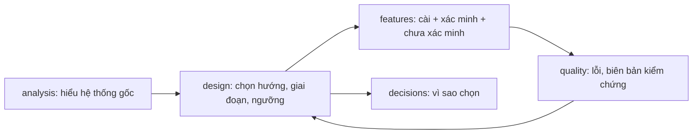

# 03 — Hệ thống tài liệu

## 3.1 Sáu thư mục chủ đề

Ánh xạ từ SuperRobot (`guide/ gameplay/ native/ script/ data/ design/`) sang bộ tổng quát:

| Thư mục | Chứa | Tương đương ở SuperRobot | Mẫu |
| --- | --- | --- | --- |
| `guide/` | Cách dùng, dựng, phát triển, gỡ lỗi, nguồn gốc đầu vào | `guide/` | [provenance](../templates/provenance.md), [release-plan](../templates/release-plan.md) |
| `design/` | Kế hoạch, lộ trình, kiến trúc, khảo sát khả thi, chuyển nền tảng | `design/` | [design-doc](../templates/design-doc.md), [roadmap](../templates/roadmap.md), [port-plan](../templates/port-plan.md), [research-spike](../templates/research-spike.md) |
| `analysis/` | Phân tích tĩnh hệ thống/định dạng/dữ liệu có sẵn | `data/` + `script/` | [analysis-doc](../templates/analysis-doc.md) |
| `features/` | Tính năng đã/đang cài, kèm xác minh | `native/` | [feature-doc](../templates/feature-doc.md) |
| `quality/` | Sổ lỗi, sửa lỗi, biên bản kiểm chứng, quy tắc | `gameplay/` | [bug-register](../templates/bug-register.md), [verification-record](../templates/verification-record.md) |
| `decisions/` | Quyết định kiến trúc (ADR) | (rải trong design) | [decision-record](../templates/decision-record.md) |

**Quy tắc cứng** (có test bảo vệ): không có `.md` rời trong `docs/` ngoài `README.md`; mọi doc ở `docs/<chủ đề>/` phải được liệt kê trong `docs/README.md`.

## 3.2 Tiêu đề bắt buộc của mỗi tài liệu

```markdown
# Tên tài liệu: ý chính một dòng

Ngày: 2026-01-31. Trạng thái: **<nhãn>**. Phạm vi bằng chứng: <tĩnh | test | chạy thật trên X>.
Liên quan: [tài liệu A](a.md) · [tài liệu B](../design/b.md)
```

### Nhãn trạng thái chuẩn

| Nhãn | Nghĩa |
| --- | --- |
| `Ý tưởng` | Chưa cam kết, chưa có khảo sát |
| `Kế hoạch` | Đã chọn hướng, có giai đoạn & ngưỡng, chưa cài |
| `Phân tích tĩnh` | Kết luận từ đọc/đo, chưa chạy thật |
| `Đã cài – chưa kiểm chứng` | Có mã, chưa có bằng chứng chạy |
| `Đã cài – kiểm chứng một phần` | Có bằng chứng cho phạm vi nêu rõ; còn danh sách chưa xác minh |
| `Đã cài – đã kiểm chứng` | Mọi mục trong ngưỡng đều có bằng chứng |
| `Lịch sử` | Ghi lại thời điểm đó; không còn đại diện cho hiện tại |

## 3.3 Khung nội dung theo loại tài liệu



Mỗi loại có mẫu riêng ở [`templates/`](../templates/). Điểm chung: **đo được, truy nguyên được, có phần giới hạn**.

## 3.4 Chỉ mục `docs/README.md`

- Bảng thư mục → nội dung 1 dòng.
- Mục **"Bắt đầu từ đây"**: ánh xạ *mục đích người đọc → tài liệu* (không theo cấu trúc thư mục).
- Mỗi chủ đề một bảng `Tài liệu | Nội dung (1–2 câu)`; tài liệu liên quan đi cặp trên cùng dòng (`A → B → C`).
- Cuối: mục **"Tầng kiểm chứng"** nhắc rằng *"có ảnh chụp" ≠ "đã nghiệm thu"*. Mẫu: [docs-index.md](../templates/docs-index.md).

## 3.5 Đa ngôn ngữ

| Quy ước | Chi tiết |
| --- | --- |
| Tên file | `ten.md` (ngôn ngữ gốc), `ten.vi.md`, `ten.en.md` — cùng thư mục |
| Thanh ngôn ngữ | Dòng đầu: `> **Ngôn ngữ / Language:** [Tiếng Việt](x.vi.md) · [English](x.en.md) · [Gốc](x.md)` |
| Chỉ mục | Thêm cột `Ngôn ngữ` chứa link vi/en |
| Dịch tự động | Bảo vệ khối code, inline code, URL trong `[text](url)` trước khi dịch (xem `tools/translation/translate_markdown.py` của SuperRobot) |
| Thuật ngữ | Giữ **bảng thuật ngữ** thống nhất (`localization-terms`) trước khi dịch hàng loạt |

> [!WARNING]
> Dịch máy cần rà soát: các tài liệu kỹ thuật có thể bị dịch sai tên riêng/ký hiệu. Đánh dấu bản dịch tự động trong trạng thái cho tới khi có người duyệt.

## 3.6 Vòng đời tài liệu

1. **Viết** từ mẫu, điền ngày/trạng thái.
2. **Liệt kê** vào `docs/README.md`.
3. **Chạy** `test_docs` (link, đường dẫn, chỉ mục).
4. **Cập nhật** khi có bằng chứng mới — sửa trạng thái, *thêm* mục (đừng viết đè lịch sử); khi không còn đúng → chuyển `Lịch sử`, không xoá.

