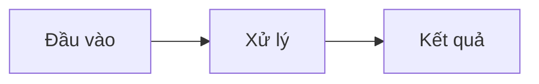

# {{Hệ thống/định dạng}}: phân tích tĩnh

Ngày: {{YYYY-MM-DD}}. Trạng thái: **Phân tích tĩnh**. Nguồn phân tích: {{đọc mã/disassemble/xuất dữ liệu/đo}}. Bản đầu vào: {{phiên bản + hash, link provenance}}.
**Chưa chạy thật**, trừ các mục ghi "đã quan sát" ở §6.

## 1. Mục đích
Vì sao cần hiểu phần này; quyết định nào phụ thuộc vào kết luận.

## 2. Phương pháp
- Công cụ/script: `tools/analysis/…`
- Cách tái lập (lệnh) và nơi lưu kết quả thô.
- Giả định.

## 3. Cấu trúc/định dạng

| Trường/phần | Vị trí | Kiểu/kích thước | Ý nghĩa | Độ chắc chắn |
| --- | --- | --- | --- | --- |
| | | | | cao / trung bình / suy đoán |

## 4. Luồng và quan hệ

## 5. Bất thường và ngoại lệ
Mục không khớp quy luật, có chứng cứ gì, đã loại trừ thế nào.

## 6. Quan sát chạy thật (nếu có)

| Quan sát | Điều kiện | Kết quả |
| --- | --- | --- |

## 7. Hệ quả cho thiết kế
- → ảnh hưởng tới [design/…](../design/x.md).

## 8. Chưa xác minh
- [ ] …
